# Halloween : Le Labyrinthe Hanté

## Introduction

Bonjour les apprentis programmeurs ! Aujourd'hui, nous allons créer un super jeu de labyrinthe sur le thème d'Halloween avec Scratch. Mais attention, dans ce jeu, il va y avoir une surprise. Dans ce projet, tu vas apprendre à :
- Dessiner un labyrinthe effrayant
- Créer un petit personnage qui se déplace avec la souris
- Ajouter des bonbons à ramasser
- Et le meilleur pour la fin : Créer une surprise d'Halloween

Et pour faire tout cela, tu vas avoir besoin :
- Un ordinateur avec Scratch
- 3 heures de temps
- Ton imagination !

Pour commencer, va sur le site de Scratch (scratch.mit.edu).

Clique sur "Créer" pour démarrer un nouveau projet. Au démarrage, la scène est vide avec juste le petit chat. Mais on en a pas besoin alors tu vas pouvoir le supprimer en cliquant sur la petite poubelle collé à la vignette du chat. Désolé petit chat, tu vas nous manquer.

## Création du labyrinthe

On va s'attaquer à la création du labyrinthe. Tout cela va se faire dans les arrières plans. Tu vas donc cliquer sur scène puis sur l'onglet "Arrière-plans".

Le premier arrière-plan va nous servir à faire l'écran titre. D'ailleurs on va lui donner un nom et "écran titre", c'est bien. On est sur le thème d'halloween donc on va faire un truc bien sombre. Le plus simple pour faire ça c'est de faire un gros rectangle noir qui recouvre tout l'écran (La zone clair que tu vois sur la scène à peindre correspond à la zone qui sera affiché à l'écran en jeu. Donc le rectangle noir qui tu vas dessiner doit bien le dépasser).

Ensuite, sur cette arrière-plan en bas, on va dessiner un petit cercle blanc. Ce cercle va servir de bouton pour lancer la partie.

Maintenant, on va faire un premier niveau en dupliquant l'arrière-plan. Tu peux faire ça en cliquant avec le bouton droit de la souris sur la vignette de l'arrière-plan puis en cliquant sur "dupliquer".

Cet arrière plan on va l'appeler "niveau1". A partir de là, tu vas dessiner un autre petit cercle blanc qui servira d'arrivé au premier niveau et ensuite un couloir pour le labyrinthe. C'est le premier niveau quand même, tu peux faire un couloir assez épais pour commencer. Attends un peu avant de faire un niveau affrayant. 😉

Moi je l'ai fait comme ça par exemple. Bon d'accord, un labyrinthe sans le moindre embranchement, c'est très simple. Mais pas tant que ça, tu verras pourquoi dans le chapitre suivant...

## Lancement de la partie et programmation des déplacements

On ajouter un peu d'interraction. Déjà faire en sorte de pouvoir lancer une nouvelle partie, ça serait un bon début, non ?

Retourne sur l'arrière-plan de l'écran titre puis crée un sprite qui va servir de bouton de lancement de la partie. Pour cela, place le curseur de la souris sur l'icon avec un chat, un menu va apparaitre, tu vas alors cliquer sur le bouton en haut : Importer un sprite.

Il y a dans le répertoire resources des images correspondant à des bonbons. Prends-en un. Ensuite il faut lui donner un nom, appel-le ... "joueur". Ouais c'est un bonbon mais on l'appel joueur. Par contre, il est un peu grand donc il faudrait réduire sa taille. 

Clique sur l'onglet "Costume" pour le modifier. Ensuite utilise l'outil "sélectionner" pour sélectionner tout le bonbon. Tu verras qu'un cadre bleu va apparaître avec de petit carré aux bord. Clique en maintenant le bouton de la souris sur l'un d'eux tout en appuyant sur la touche atl du clavier enfoncé. Ça va te permettre de réduire sa taille tout en conservant ses proportions.

Tu remarqueras que le costume à un nom lui aussi. Tu vas l'appeler "démarrage". Le bonbon va nous servir d'appat pour lancer le jeu. 

Ensuite, il te reste à déplacer le sprite sur la scène de manière à le mettre dans le rond blanc en bas.

Et maintenant place au code ! Clique le l'onglet "Code" pour pouvoir coder quelque chose.

### Première étape : l'initialisation ! 

Quand on clique sur le drapeau vert, doit doit retourner dans l'écran titre avec le bonbon au centre du cercle blanc.

Tu vas avoir besoin de ces blocs :

<pre class="blocks">
quand le drapeau vert pressé
</pre>

<pre class="blocks">
montrer
</pre>

<pre class="blocks">
basculer sur l'arrière-plan "écran titre"
</pre>

<pre class="blocks">
basculer sur le costume "démarrage"
</pre>

<pre class="blocks">
aller à x: "1" y: "-123"
</pre>
Les chiffres que tu vois pour ce bloc correspondent au coordonnée actuelle de bonbon. Pas besoin d'y toucher donc. Ceux qu'il y a dans le tutoriel que tu es en train de lire ne servent que d'exemple.

Voila ce que tu devrais avoir normalement :

<pre class="blocks">
quand le drapeau vert pressé
basculer sur l'arrière-plan "écran titre"
aller à x: "1" y: "-123"
basculer sur le costume "démarrage"
montrer
</pre>

Si tu t'amuse à changer l'arrière plan et déplacer le bonbon puis que tu cliques sur le drapeau vert, tu devrais revenir comme avant.

### Deuxième étape : Lancer la partie !

On veut que le bonbon, dès que le curseur de la souris le touche, se transforme en petit cercle rouge du joueur et qu'on bascule sur le premier niveau du labyrinthe.

Mais tout d'abord, on doit ajouter un costume à notre bonbon pour qu'il puisse se transformer en petit cercle rouge. Donc clique sur la vignette du bonbon pour le sélectionner et passe sur l'onglet "Costumes".

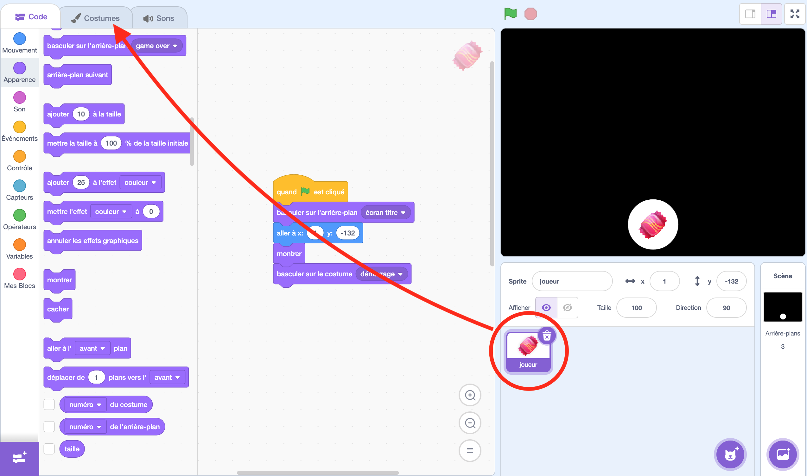

Ensuite met le curseur de la souris sur le petit chat en bas à gauche puis clique sur le pinceau pour peindre un nouveau costume

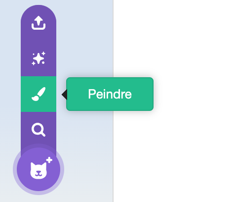

Il te reste juste à dessiner un petit cercle rouge au milieu... ou bleu... ou vert... peu importe. Pour te faciliter la vie, tu peux utiliser la touche majuscule en dessinant pour que le cercle soit toujours bien proportionné. Tu peux le dessiner partout et ensuite le déplacer pour le mettre au milieu. Il y a un petit aimant pour t'aider à le centrer. Enfin donne lui le nom "en cours".

Ensuite retourne sur l'onglet de Code. Tu vas avoir besoin de ces blocs :

<pre class="blocks">
touche le pointeur de souris
</pre>

<pre class="blocks">
basculer sur l'arrière-plan "niveau1"
</pre>

<pre class="blocks">
basculer sur le costume "en cours"
</pre>

<pre class="blocks">
attendre jusqu'à ce que ?
</pre>

Voila ce que tu devrais avoir normalement :

<pre class="blocks">
attendre jusqu'à ce que touche le pointeur de souris ?
basculer sur l'arrière-plan "niveau1"
basculer sur le costume "en cours"
</pre>

Normalement, si tu cliques sur le drapeau vert, ça devrait afficher le première arrière-plan avec le bonbon et c'est quand tu mets le curseur de la souris dessus que le premier niveau du labyrinthe se révèle.

### Troisième étape : Le déplacement et condition d'échec !

Le joueur (qui est représenté par le petit cercle rouge) suit le très près le curseur de la souris. S'il touche le bord du labyrinthe, c'est perdu. On bascule alors sur un écran "game over".

Mais attend ! On doit d'abord ajouter un nouvel arrière-plan. Tu sais comment y aller maintenant. Et comme la dernière fois, tu peux dupliquer le premier arrière plan. Ensuite il faut remettre le fond tout noir, tu peux pour cela utiliser l'outil de sélection, cliquer la zone blanche pour la sélectionner et cliquer sur l'icone de poubelle pour la supprimer.

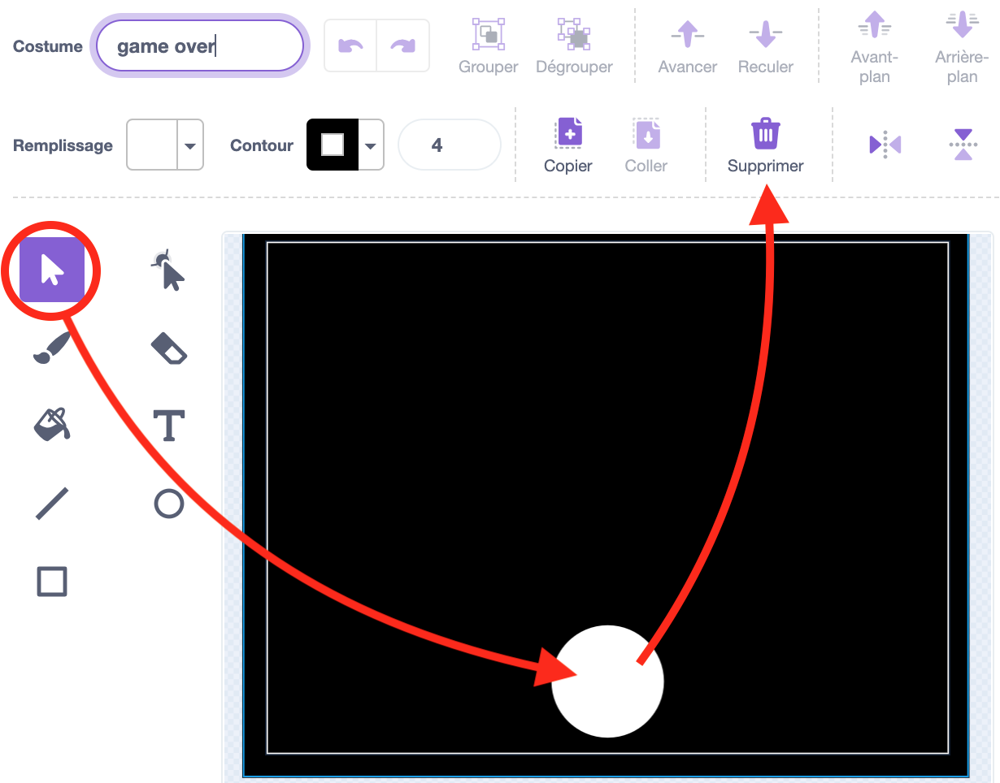

Et après, il faudrait ajouter un petit message pour dire qu'on a perdu.

Quand ça sera fait, tu vas pouvoir retourner sur l'onglet de code. Tu vas avoir besoin de ces blocs :

<pre class="blocks">
répéter indéfiniment
</pre>

<pre class="blocks">
si ... alors
</pre>

<pre class="blocks">
couleur "noir" touchée ?
</pre>

<pre class="blocks">
cacher
</pre>

<pre class="blocks">
basculer sur l'arrière-plan "game over"
</pre>

<pre class="blocks">
aller à "pointeur de souris"
</pre>

Voila ce que tu devrais avoir normalement :

<pre class="blocks">
répéter indéfiniment
  si couleur "noir" touchée ? alors
    cacher
    basculer sur l'arrière-plan "game over"
  aller à "pointeur de souris"
</pre>

Clique maintenant sur le drapeau pour faire des essais de déplacement.

## Bonbons à collecter

Le labyrinthe est un peu morne, il n'y a pas grand chose à faire dessus. Et si on ajouter des bonbons à ramasser ?

On va avoir besoin d'un nouveau sprite de bonbon. Pour de vrai bonbon pour le coup, pas juste un appat à enfant. Il y a un répertoire avec des images de bonbon, on va les utilises comme costume pour un seul sprite de bonbon. Commence par créer un sprite en plaçant le curseur de la souris sur l'icon avec un chat, un menu va apparaitre, tu vas alors cliquer sur le bouton au milieu : Peindre.

À partir de la, place le curseur de la souris sur l'icon avec un chat en bas à gauche, un autre menu va apparaitre, il reste alors à cliquer sur le bouton du haut : Importer un Costume

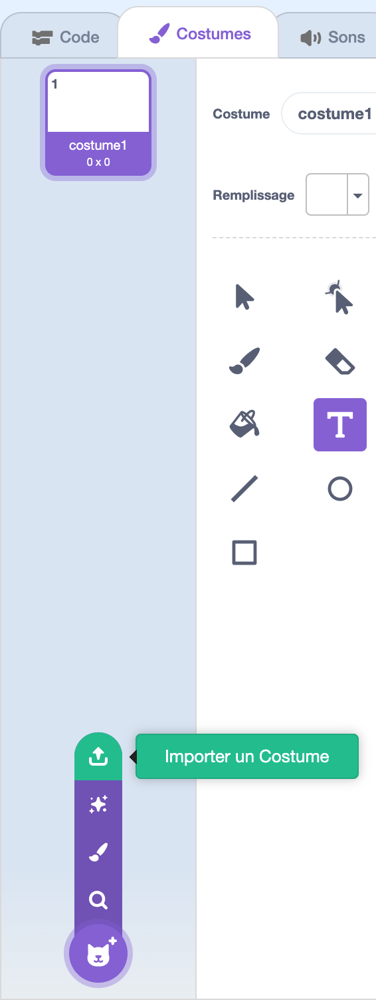

Tu peux, dans la boite de dialogue de sélection de l'image à importer en sélectionner plusieurs. Comme ça, ça va importer tous les bonbon d'un coup. Il ne te restera plus qu'à supprimer le premier costume vide en cliquant sur la poubelle en haut à droit de la vignette du costume à supprimer.

Comme tu l'avais fait avec le premier bonbon servant d'appat, il faudrait réduire la taille de ces images parce qu'elles sont vraiment énorme.

Maintenant il est temps de placer les bonbons sur le niveau en codant. Il faut pour cela que tu passes sur l'onglet "Code".

Tu vas avoir besoin de ces blocs :

<pre class="blocks">
quand l'arrière-plan bascule sur "niveau1"
</pre>

<pre class="blocks">
quand le drapeau vert pressé
</pre>

<pre class="blocks">
créer un clone de "moi-même"
</pre>

<pre class="blocks">
quand je commence comme un clone
</pre>

<pre class="blocks">
cacher
</pre>

<pre class="blocks">
montrer
</pre>

<pre class="blocks">
aller à x:"" y:""
</pre>

<pre class="blocks">
basculer sur le costume ""
</pre>

<pre class="blocks">
nombre aléatoire entre "" et ""
</pre>

Et là tu te demande : "C'est quoi un clone ?". Par défaut, il n'y a qu'un exemplaire du sprite de bonbon qui est présent dans l'écran, on va se servir de cet exemplaire comme machine à fabriquer des bonbons qui seront des clones. L'idée c'est que le sprite original soit caché, qu'on le déplace pour ensuite utiliser la fonction <code class="b">créer un clone de "moi-même"</code> et ainsi de suite.

Lorsqu'un clone est créé, il reprend les mêmes caractéristiques de son père au moment de sa création. Il y a le bloc <code class="b">quand je commence comme un clone</code> qui se déclenche sur le clone nouvellement créé et qui va donc nous permettre de faire diverses chose comme le montrer, lui choisir un costume et définir son comportement. Toute ces modifications lui seront propre.

Il y a de quoi retourner le cerveau c'est vrai parce qu'on va se retrouver avec du code qui peut être exécuté par le sprite principal, par l'un de ses clones et parfois tous.

Voila ce que tu devrais avoir normalement :

<pre class="blocks">
quand le drapeau vert pressé
cacher
</pre>

<pre class="blocks">
quand l'arrière-plan bascule sur "niveau1"
aller à x:"" y:""
créer un clone de "moi-même"
aller à x:"" y:""
créer un clone de "moi-même"
aller à x:"" y:""
créer un clone de "moi-même"
</pre>

<pre class="blocks">
quand je commence comme un clone
basculer sur le costume nombre aléatoire entre "" et ""
montrer
</pre>

On regarde le résultat ? Il devrait y avoir des bonbons qui apparaissent quand on bascule sur le premier niveau.

Et maintenant, on va les manger. On va faire en sorte que lorsque le joueur (symbolisé par le petit rond rouge) touche l'un des clones, celui-ci disparaisse progressivement. On pourrait même ajouter d'autre effets pourquoi pas mais ça doit finir par la suppression du clone.

Tu vas avoir besoin de ces blocs :

<pre class="blocks">
attendre jusqu'à ce que
</pre>

<pre class="blocks">
répéter "" fois
</pre>

<pre class="blocks">
ajouter "" à l'effet "fantôme"
</pre>

<pre class="blocks">
touche le "joueur" ?
</pre>

<pre class="blocks">
supprimer ce clone
</pre>

Voila ce que tu devrais avoir normalement :

<pre class="blocks">
quand je commence comme un clone
basculer sur le costume nombre aléatoire entre "" et ""
montrer
attendre jusqu'à ce que touche le "joueur" ?
répéter "5" fois
  ajouter "20" à l'effet "fantôme"
supprimer ce clone
</pre>

On mange les bonbons ? C'est marrant de les voir disparaitre. N'hésite pas à ajouter d'autre effet lors de leur disparition. Mais par contre, tu as peut être remarqué, quand on perd, les bonbon restes. Pareil lorsqu'on clique sur le drapeau vert. Il devrait disparaitre à ces moments là. Que faudrait-it modifié ?

Voila ce que tu devrais avoir normalement en plus :

<pre class="blocks">
quand le drapeau vert pressé
cacher
supprimer ce clone
</pre>

<pre class="blocks">
quand l'arrière-plan bascule sur "game over"
supprimer ce clone
</pre>

Vas-y essai maintenant. C'est mieux non ? Mais ce qui serait encore mieux, ce serait de compter les points ! On fait ça ?

On va tout d'abord avoir besoin d'un nouveau sprite pour afficher le score. Plaçe le curseur de la souris sur l'icon avec un chat, un menu va apparaitre, tu vas alors cliquer sur le bouton au milieu : Peindre.

Ensuite place le curseur de la souris sur l'icon avec un chat en bas à gauche et clique dessus pour choisir un costume dans la liste de costume proposé.

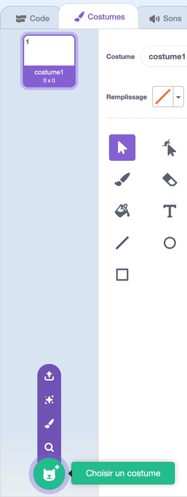

Il existe des costumes représentant chaque chiffre. Il faudra tous les mettre en commençant par 1 et en finissant avec 0.

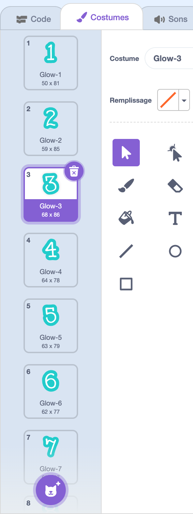

Il ne reste plus qu'à coder le fonctionnement du score. Il faut que le score s'initialise à 0, une variable sera donc nécessaire. Ce score devrait augmenter de 1 à chaque bonbon mangé. Il est possible d'utiliser des messages pour cela. Au passage, ça serait bien que le score soit orange et un peu plus petit, c'est plus dans le thème d'halloween et ça prend moins de place. Il existe un bloc de code qui permet de changer la couleur d'un sprite ainsi que sa taille selon celle d'origine.

Tu vas avoir besoin de ces blocs.

<pre class="blocks">
quand le drapeau vert pressé
</pre>

<pre class="blocks">
mettre "score" à "0"
</pre>

<pre class="blocks">
mettre l'effet "couleur" à ""
</pre>

<pre class="blocks">
basculer sur le costume ""
</pre>

<pre class="blocks">
costume suivant
</pre>

<pre class="blocks">
envoyer à tous ""
</pre>

<pre class="blocks">
quand je reçois ""
</pre>

<pre class="blocks">
ajouter "" à "score"
</pre>

<pre class="blocks">
mettre la taille à "50" % de la taille initiale
</pre>

Voila ce que tu devrais avoir normalement :

<pre class="blocks">
quand le drapeau vert pressé
mettre "score" à "0"
mettre la taille à "50" % de la taille initiale
mettre l'effet "couleur" à "120"
basculer sur le costume ""
</pre>

<pre class="blocks">
quand je reçois ""
ajouter "1" à "score"
costume suivant
</pre>

Il reste à ajouter l'envoi du message, tu vois où il faudrait le mettre ?

Quand ça sera fait, tu pourras essayer de voir le résultat. Et constater que le score s'initialise à 0 puis s'incrémente de 1 à chaque bonbon mangé.
Si tu en à envie, tu pourrais ajouter un effet au moment où l'on mange un bonbon. Par exemple que le score grossisse brievement avant de reprendre sa taille d'origine.

Cela dit, notre affichage du score a un problème : Il ne fonctionne qu'avec les nombres à un chiffre. A partir de 10, le score passe juste à 0. Il faudrait donc pouvoir gérer le chiffre les dizaines. Comment pourrait-on faire ça ?

Contrairement aux bonbons, on ne va pas pouvoir utiliser le clone, trop compliqué. Mais on peut dupliquer le sprite pour en faire un autre servant aux dizaines. Tu peux faire ça en faisant un clique avec le bouton droit de la souris sur la vignette du sprite et clique sur "dupliquer"

La différence dans le code qu'il y aura par rapport au sprite score original, c'est :
- qu'il n'y aura pas la gestion de la variable score
- que le sprite est caché à l'initialisation
- qu'on ne montre le sprite que lorsque le score atteint 10
- qu'on ne passe au custume suivant qu'à chaque dizaine

Voici un bloc qui va pouvoir t'être utile

<pre class="blocks">
"" modulo ""
</pre>
C'est un bloc qui permet de récupérer ce qu'il reste d'une division.

Voila ce que tu devrais avoir normalement :

<pre class="blocks">
quand le drapeau vert pressé
mettre la taille à "50" % de la taille initiale
mettre l'effet "couleur" à "120"
basculer sur le costume ""
cacher
</pre>

<pre class="blocks">
quand je reçois ""
si "score" > 0 et "score" modulo 10 = 0 alors
  costume suivant
  montrer
</pre>

Essai pour voir le résultat. Tu devrais avoir les deux chiffres maintenant. Si tu veux, tu peux aller plus loin et ajouter le chiffre des centaines.

## Changement de niveau

On va mettre en place plusieurs niveaux dans notre jeu. Trois ça sera bien. Le plus simple pour cela est de dupliquer le niveau précédent, de supprimer le superflux pour ne garder que l'arrivé. C'est cet arrivé qui va servir de point de départ du nouveau niveau. Il restera plus qu'à dessiner le reste du niveau. 

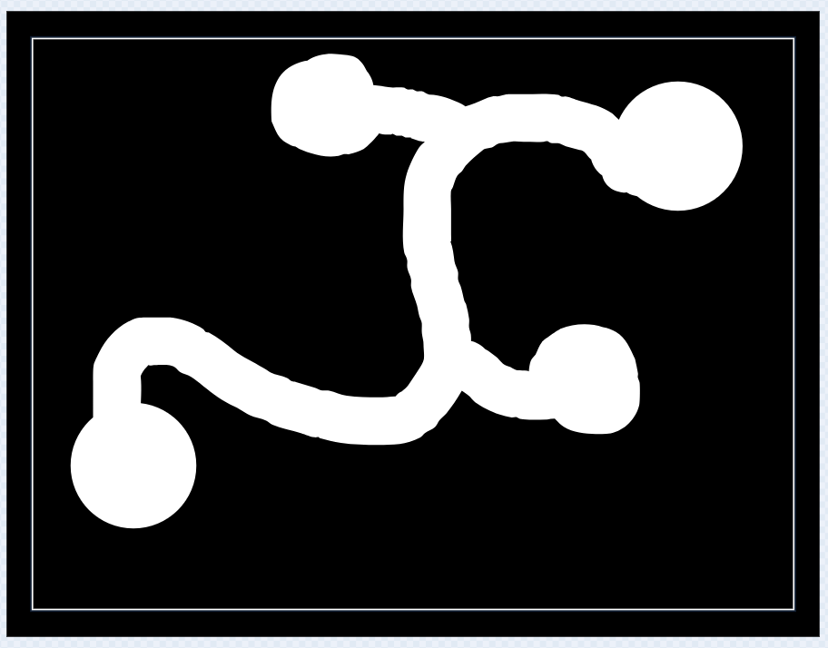

Il faudra faire pareil pour le 3e niveau. Idéalement, il faudrait que les niveaux soient de plus en plus diffice. Il faudrait même que le 3e niveau soit très très difficile pour inciter le joueur à se rapprocher de l'écran pour bien voir.

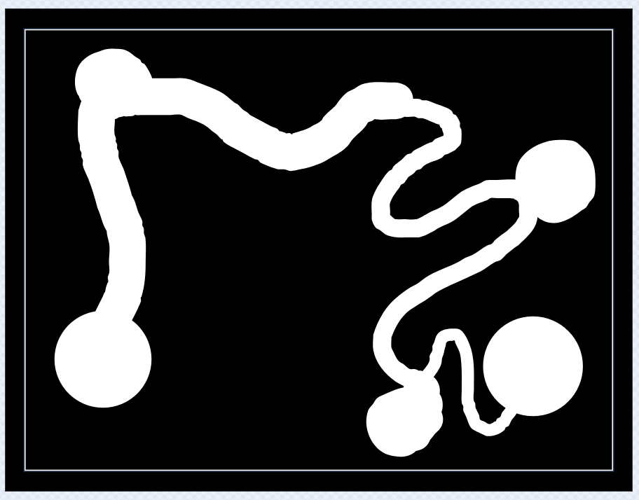

C'est un bonbon spécial qui va permettre au joueur de passer au niveau suivant. On va donc commencer par dupliquer le sprite bonbon. Mais il va y avoir quelques changement dessus.

Il va d'abord falloir supprimer la gestion des clones. On en crée plus de clone, on ne fait que bouger le sprite à chaque niveau. On ne supprime plus les clones, on se contente de cacher le sprite. Et au lieu d'utiliser le bloc <code class="b">quand je commence comme un clone</code>, on va utiliser un bloc personnalisé !

Pour faire un bloc personnalisé, il faut aller dans le menu "Mes blocs" puis cliquer sur "Créer un bloc"

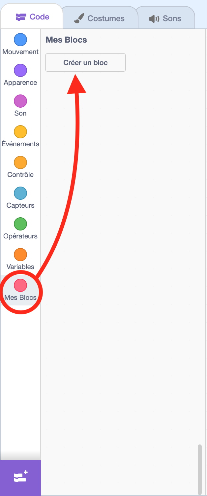

Dans la popin qui apparait, il faudrait donner un nom au bloc, disons "gérer le bonbon pour aller au", ainsi qu'au paramètre, hum... "niveau suivant". Et enfin cliquer sur "Ok" pour valider.

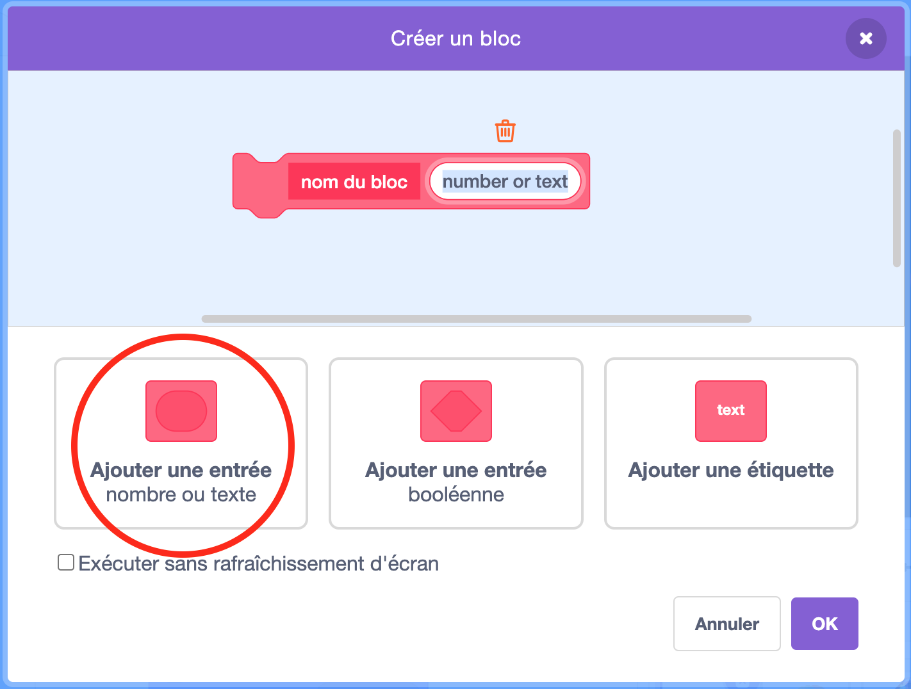

Un nouveau bloc va apparaitre qui s'appel <code class="b">définir "gérer le bonbon pour aller au" "niveau suivant"</code>. C'est ce bloc qui va remplacer <code class="b">quand je commence comme un clone</code>. Pour l'appeler, il faudra utiliser le bloc <code class="b">gérer le bonbon pour aller au ""</code> qui a été créé. Ce bloc attend un paramètre, il faut mettre le nom du niveau suivant parmis les arrière-plans.

Voila pour les clones, il reste encore quelques modifications. La bascule du costume et son affichage devrait se faire lorsque l'on positionne le bonbon et non au déclenchement de la fonction crée. De même il faudra ajouter un bloc pour réinitialiser l'effet fantôme à 0. aussi, histoire de ne distinguer un peu des autres bonbons et le rendre intéressant, il faudrait doubler sa taille.

Et enfin pour terminer, lorsque le bonbon est touché, il ne faudrait pas supprimer le clone mais mettre à la place un bloc pour passer au niveau passé en paramètre de la fonction.

Voila ce que tu devrais avoir normalement comme code :

<pre class="blocks">
quand l'arrière-plan bascule sur "niveau1"
aller à x:"" y:""
basculer sur le costume nombre aléatoire entre "" et ""
mettre l'effet fantôme à "0"
mettre la taille à "200" % de la taille d'origine
montrer
gérer le bonbon pour aller au "niveau2"
</pre>

<pre class="blocks">
définir "gérer le bonbon pour aller au" "niveau suivant"
attendre jusqu'à ce que touche le "joueur" ?
répéter "5" fois
  ajouter "20" à l'effet "fantôme"
basculer sur l'arrière-plan "niveau suivant"
</pre>

<pre class="blocks">
quand le drapeau vert pressé
cacher
</pre>

<pre class="blocks">
quand l'arrière-plan bascule sur "game over"
cacher
</pre>

Voila, si tout se passe bien, en touchant ce bonbon spécial, on devrait passer au niveau suivant. Mais on ne va pas s'arrêter là. Enfin si pour le labyrinthe mais pour la petite surprise.

## Envoyez la surprise !

Il est très important, pour que la surprise fonctionne bien, que le dernier niveau soit difficile... surtout vers la fin. Il faut que le joueur soit bien concentré pour essayer de le finir. Donc pour faire cela, il ne faut pas hésiter à réduire la taille du couloir. Un peu comme sur l'image ci-dessous.

On va aussi dupliquer l'arrière-plan "game over" qui va nous servir de base pour faire la surprise. On va appeler cet arrière-plan "surprise". Mais en attendant de faire une belle surprise, on va juste remplacer le message "game over" par "boo !"

Ensuite ce que l'on va faire, c'est quelques modifications dans le code pour déclencher la surprise.

Dans le code du sprite servant à passer au niveau suivant qui est normalement appelé "arrivé". Dans ce qui permet de placer le bonbon dans le niveau 3, contrairement au premier et deuxième niveau, il ne faudra pas réafficher le bonbon mais le laisser caché. Le bonbon ne devra pas être placé à l'arrivé mais quelques centimètres avant. Et enfin, on ne met pas le nom du prochain niveau mais le nom de l'arrière-plan contenant la petit surprise.

Ça devrait ressembler à cela.

<pre class="blocks">
quand l'arrière-plan bascule sur "niveau3"
aller à x:"" y:""
basculer sur le costume nombre aléatoire entre "" et ""
gérer le bonbon pour aller au "surprise"
</pre>

Ensuite, dans le code du sprite gérant les bonbons normaux. Dans ce qui permet de placer les bonbons dans le niveau 3, le dernier bonbon est à mettre à l'arrivé à la place du bonbon qui servait à passer au niveau suivant. Mais pour que l'illusion soit parfaite, il faut lui donner la même taille que le bonbon d'arrivé.

Ça devrait ressembler à cela.

<pre class="blocks">
quand l'arrière-plan bascule sur "niveau3"
aller à x:"" y:""
créer un clone de "moi-même"
aller à x:"" y:""
créer un clone de "moi-même"
aller à x:"" y:""
mettre la taille à "200" % de la taille d'origine
créer un clone de "moi-même"
mettre la taille à "100" % de la taille d'origine
</pre>

Enfin, dans le code du sprite du joueur. on va faire une petite modification pour que l'on ne passe pas à l'arrière-plan game over si l'on se trouve dans l'écran de surprise. Sinon ça va gacher la surprise.

Ca devrait ressembler à ça.

<pre class="blocks">
répéter indéfiniment
  si couleur "noir" touchée ? alors
    cacher
    basculer sur l'arrière-plan "game over"
  aller à "pointeur de souris"
</pre>

On fait un petit test. Je sais que les niveaux sont compliqué à faire maintenant mais ça permet au moins de vérifier que le jeu est toujours faisable. Et donc normalement on devrait avoir :
- un écran de lancement du jeu
- les trois niveau avec une difficulté progressive
- et enfin le dernier niveau qui s'arrête brusquement pour basculer sur la surprise
Tu as bien tout cela ?

Si non, n'hésite pas à demander un peu d'aide pour que l'on voit où ça cloche. Autrement on va pouvoir garnir notre surprise pour la rendre bien plus effrayante qu'un simple boo!. Le but c'est de faire tomber le joueur de sa chaise. C'est partie ?

On commence par retourner sur l'arrière-plan de la surprise. Supprime le message, on n'en a plus besoin. On peut se contenter d'un écran noir.

Ensuite, on va ajouter un nouveau sprite en mettant le curseur de la souris sur la tête de chat en bas à droite puis en cliquant sur peindre.

Et on ajoute un costume de sorcière (en fait il n'existe pas de sprite sorcière tout fait qui fait peur, on est obligé de passer par les costumes). Donc on met le curseur sur la tête de chat en bas à gauche et on clique sur "Choisir un costume"

Ce costume va être super ! Il s'appel "Witch"

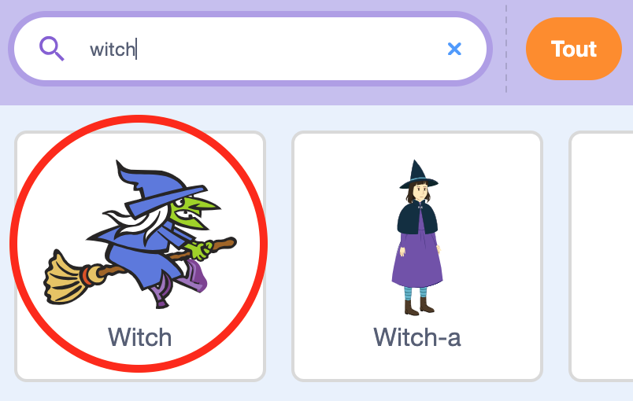

Et enfin, supprime le premier costume vide, on n'en a pas besoin.

On va pouvoir passer dans le code pour la faire apparaître brusquement lorsque l'on passe sur l'arrière-plan "surprise" puis faire un petite animation pour faire comme si la sorcière partait au loin sur son balet.

Tu vas avoir besoin de ces blocs.

<pre class="blocks">
quand l'arrière-plan bascule sur "surprise"
</pre>

<pre class="blocks">
s'orienter à ""
</pre>

<pre class="blocks">
aller à x: "" y: ""
</pre>

<pre class="blocks">
mettre taille à "" % de la taille initiale
</pre>

<pre class="blocks">
montrer
</pre>

<pre class="blocks">
répéter "" fois
</pre>

<pre class="blocks">
ajouter "" à la taille
</pre>

<pre class="blocks">
ajouter "" à l'effet "fantôme"
</pre>

<pre class="blocks">
mettre l'effet "fantôme" à ""
</pre>

<pre class="blocks">
attendre "" secondes
</pre>

<pre class="blocks">
glisser en "" secondes à x: "" y: ""
</pre>
C'est un bloc qui permet de faire une animation de déplacement. On indique combien de seconde cela va prendre pour arriver à un endroit.

<pre class="blocks">
avancer de "" pas 
</pre>
C'est un bloc qui permet de déplacer le sprite. Celui-ci va partir dans une direction défini par l'angle. On peut faire un animation en l'insérant dans un bloc <code class="b">répéter "" fois</code>.

<pre class="blocks">
tourner de "" degrès
</pre>
C'est un bloc qui permet de faire tourner le sprite. On indique de quel angle il doit tourner. On peut faire un animation en l'insérant dans un bloc <code class="b">répéter "" fois</code>.

<pre class="blocks">
fixer le sens de rotation ""
</pre>
Ce bloc permet de changer le style de rotation du sprite. En mettant "à 360°", le sprite va tourner. En mettant "gauche-droite", le sprite va se retourner.

<pre class="blocks">
cacher
</pre>

Ça pourrait ressembler à ceci :

<pre class="blocks">
quand l'arrière-plan bascule sur "surprise"
s'orienter à "90"
aller à x: "-110" y: "-100"
mettre taille à "300" % de la taille initiale
mettre l'effet "fantôme" à "100"
montrer
répéter "5" fois
  ajouter "40" à la taille
  ajouter "-20" à l'effet "fantôme"
attendre "1" secondes
répéter "3" fois
  glisser en "0.05" secondes à x: "-110" y: "-95"
  glisser en "0.05" secondes à x: "-110" y: "-105"
répéter "10" fois
  avancer de "60" pas 
  tourner de "3" degrès
mettre taille à "50" % de la taille initiale
attendre "1" secondes
s'orienter à "90"
aller à x: "260" y: "100"
fixer le sens de rotation "gauche-droite"
s'orienter à "-90"
glisser en "1" secondes à x: "-260" y: "100"
cacher
</pre>

Autre chose, lorsque l'on clique sur le drapeau, il faudrait que la sorcière soit caché. Tu vois comment tu pourrais faire cela ?

Maintenant, on va ajouter du code sur le sprite des bonbons pour qu'il y ait une pluie de bonbon au passage de la sorcière. On va utiliser pour cela les messages. Tu te rappel du message pour dire qu'un bonbon est mangé ? Ben la c'est pour déclencher une pluie de bonbon. On va utiliser les clones pour faire apparaêtre plein de bonbon à la position de la sorcière et les faire tomber. Chaque bonbon devra disparaître en arrivant en bas de l'écran.

Tu vas avoir besoin de ses blocs :

<pre class="blocks">
quand je reçois le message "pluie de bonbon"
</pre>

## Poliçage

## Conclusion

Bravo ! Tu as créé ton propre jeu de labyrinthe hanté. Tu peux maintenant :
- Ajouter plus de niveaux
- Créer de nouveaux obstacles
- Partager ton jeu avec tes amis

Amuse-toi bien dans ton labyrinthe hanté ! 👻🎃

