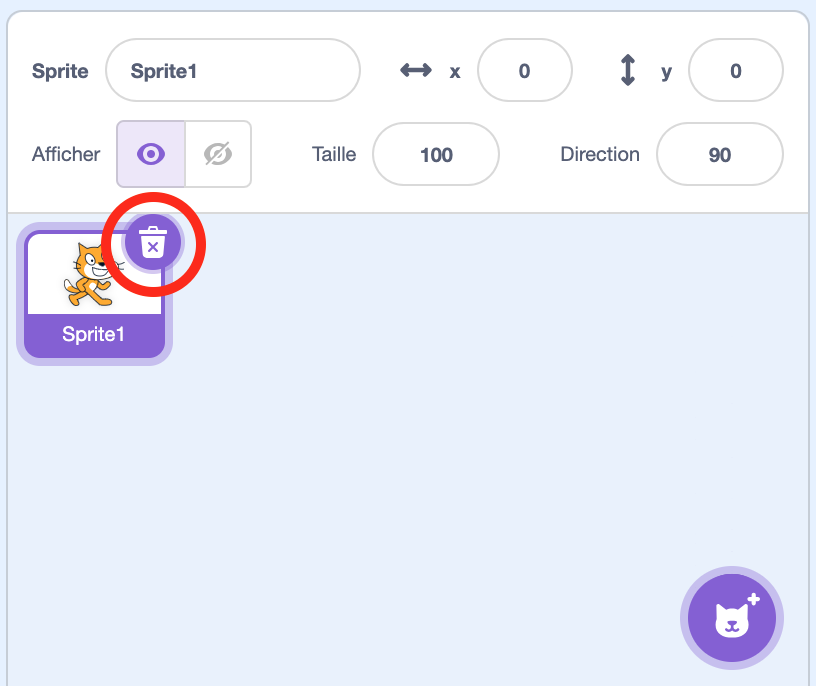
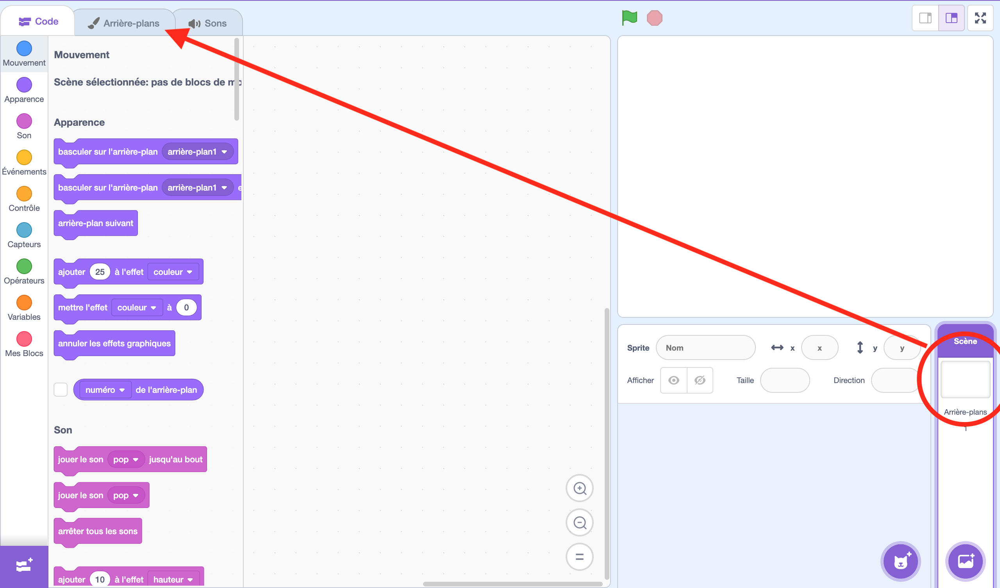
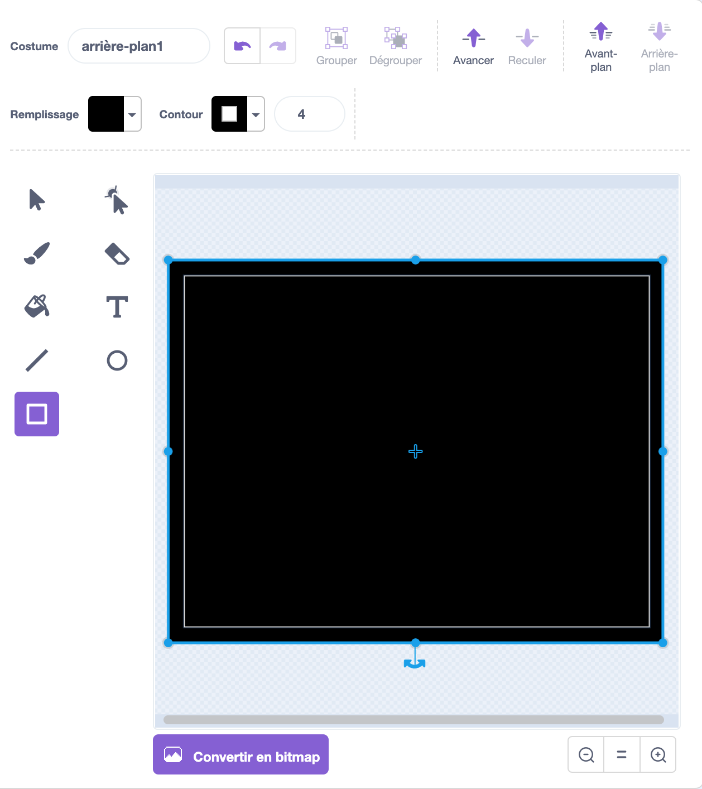
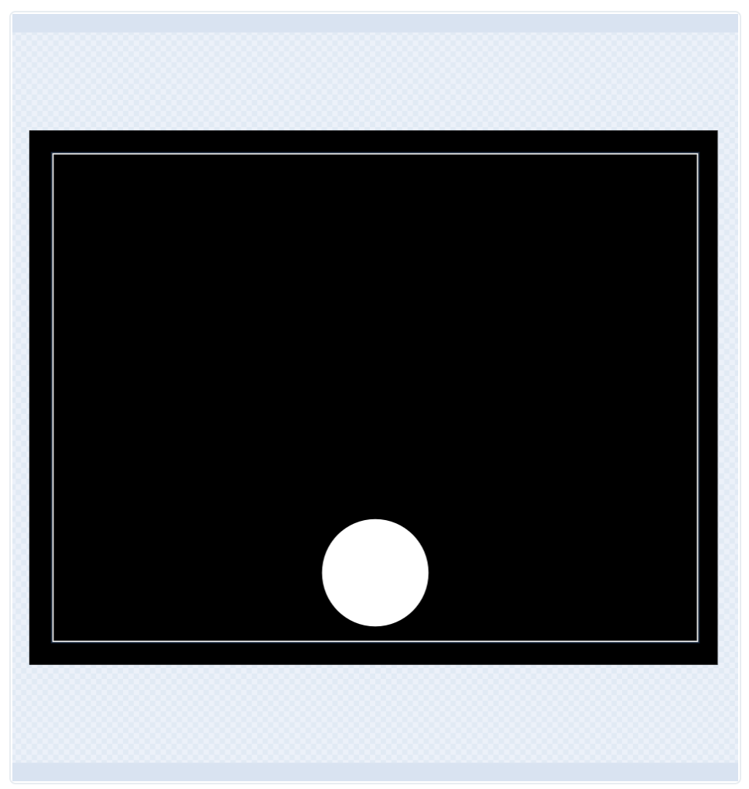
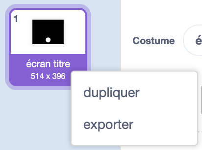
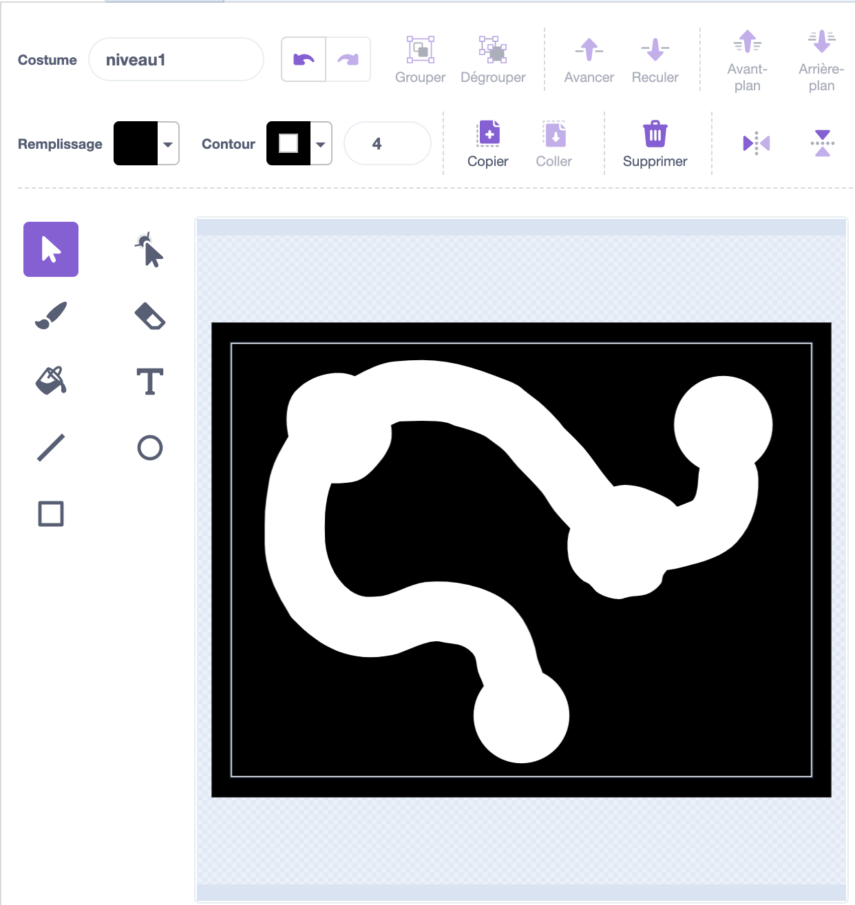
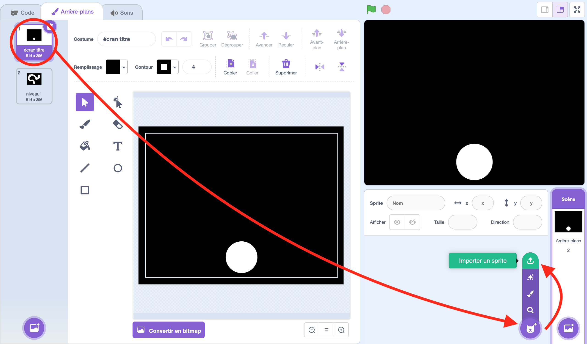
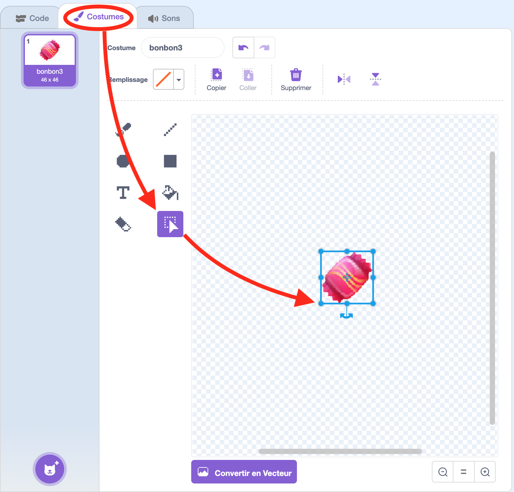
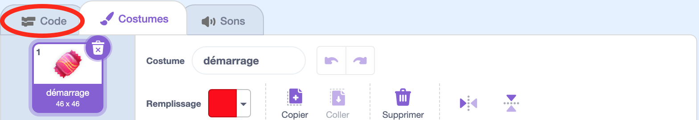

# Halloween : Le Labyrinthe Hanté

## Introduction

Bonjour les apprentis programmeurs ! Aujourd'hui, nous allons créer un super jeu de labyrinthe sur le thème d'Halloween avec Scratch. Mais attention, dans ce jeu, il va y avoir une surprise. Dans ce projet, tu vas apprendre à :
- Dessiner un labyrinthe effrayant
- Créer un petit personnage qui se déplace avec la souris
- Ajouter des bonbons à ramasser
- Et le meilleur pour la fin : Créer une surprise d'Halloween

Et pour faire tout cela, tu vas avoir besoin :
- Un ordinateur avec Scratch
- 3 heures de temps
- Ton imagination !

Pour commencer, va sur le site de Scratch (scratch.mit.edu).

Clique sur "Créer" pour démarrer un nouveau projet. Au démarrage, la scène est vide avec juste le petit chat. Mais on en a pas besoin alors tu vas pouvoir le supprimer en cliquant sur la petite poubelle collé à la vignette du chat. Désolé petit chat, tu vas nous manquer.

## Création du labyrinthe

On va s'attaquer à la création du labyrinthe. Tout cela va se faire dans les arrières plans. Tu vas donc cliquer sur scène puis sur l'onglet "Arrière-plans".

Le premier arrière-plan va nous servir à faire l'écran titre. D'ailleurs on va lui donner un nom et "écran titre", c'est bien. On est sur le thème d'halloween donc on va faire un truc bien sombre. Le plus simple pour faire ça c'est de faire un gros rectangle noir qui recouvre tout l'écran (La zone clair que tu vois sur la scène à peindre correspond à la zone qui sera affiché à l'écran en jeu. Donc le rectangle noir qui tu vas dessiner doit bien le dépasser).

Ensuite, sur cette arrière-plan en bas, on va dessiner un petit cercle blanc. Ce cercle va servir de bouton pour lancer la partie.

Maintenant, on va faire un premier niveau en dupliquant l'arrière-plan. Tu peux faire ça en cliquant avec le bouton droit de la souris sur la vignette de l'arrière-plan puis en cliquant sur "dupliquer".

Cet arrière plan on va l'appeler "niveau1". A partir de là, tu vas dessiner un autre petit cercle blanc qui servira d'arrivé au premier niveau et ensuite un couloir pour le labyrinthe. C'est le premier niveau quand même, tu peux faire un couloir assez épais pour commencer. Attends un peu avant de faire un niveau affrayant. 😉

Moi je l'ai fait comme ça par exemple. Bon d'accord, un labyrinthe sans le moindre embranchement, c'est très simple. Mais pas tant que ça, tu verras pourquoi dans le chapitre suivant...

## Lancement de la partie et programmation des déplacements

On ajouter un peu d'interraction. Déjà faire en sorte de pouvoir lancer une nouvelle partie, ça serait un bon début, non ?

Retourne sur l'arrière-plan de l'écran titre puis crée un sprite qui va servir de bouton de lancement de la partie. Pour cela, place le curseur de la souris sur l'icon avec un chat, un menu va apparaitre, tu vas alors cliquer sur le bouton en haut : Importer un sprite.

Il y a dans le répertoire resources des images correspondant à des bonbons. Prends-en un. Ensuite il faut lui donner un nom, appel-le ... "joueur". Ouais c'est un bonbon mais on l'appel joueur. Par contre, il est un peu grand donc il faudrait réduire sa taille. 

Clique sur l'onglet "Costume" pour le modifier. Ensuite utilise l'outil "sélectionner" pour sélectionner tout le bonbon. Tu verras qu'un cadre bleu va apparaître avec de petit carré aux bord. Clique en maintenant le bouton de la souris sur l'un d'eux tout en appuyant sur la touche atl du clavier enfoncé. Ça va te permettre de réduire sa taille tout en conservant ses proportions.

Tu remarqueras que le costume à un nom lui aussi. Tu vas l'appeler "démarrage". Le bonbon va nous servir d'appat pour lancer le jeu. 

Ensuite, il te reste à déplacer le sprite sur la scène de manière à le mettre dans le rond blanc en bas.

Et maintenant place au code ! Clique le l'onglet "Code" pour pouvoir coder quelque chose.

C'est l'heure de faire bouger notre personnage :
1. Programmer les touches directionnelles
2. Empêcher le personnage de traverser les murs
3. Tester les déplacements

## Étape 5 : Ajout des éléments d'Halloween

Rendons notre jeu plus amusant :
1. Ajouter des fantômes qui se déplacent
2. Créer des bonbons à collecter
3. Mettre des sons effrayants

## Étape 6 : Création des règles du jeu

Finissons notre jeu :
1. Ajouter un score pour les bonbons collectés
2. Créer une condition de victoire
3. Ajouter un minuteur

## Conclusion

Bravo ! Tu as créé ton propre jeu de labyrinthe hanté. Tu peux maintenant :
- Ajouter plus de niveaux
- Créer de nouveaux obstacles
- Partager ton jeu avec tes amis

Amuse-toi bien dans ton labyrinthe hanté ! 👻🎃

