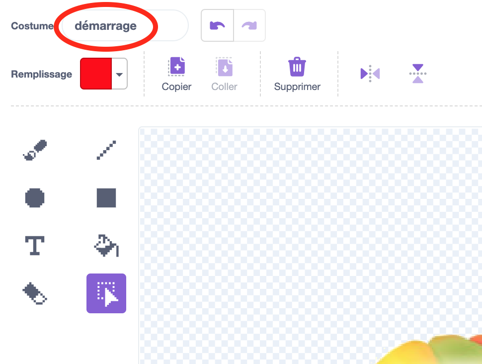
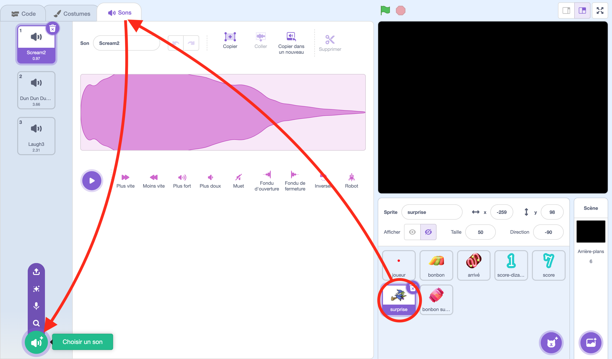

## Introduction

Bonjour les apprentis programmeurs ! Aujourd'hui, nous allons créer un super jeu de labyrinthe sur le thème d'Halloween avec Scratch. Mais attention, dans ce jeu, il y aura une surprise. Dans ce projet, tu vas apprendre à :
- Dessiner un labyrinthe effrayant
- Créer un petit personnage qui se déplace avec la souris
- Ajouter des bonbons à ramasser
- Et le meilleur pour la fin : créer une surprise d'Halloween

Et pour faire tout cela, tu vas avoir besoin de :
- Un ordinateur avec Scratch
- Environ 3 heures
- Ton imagination !

Pour commencer, va sur le site de [Scratch](scratch.mit.edu) puis clique sur « Créer » pour démarrer un nouveau projet.

Au démarrage, la scène contient le petit chat : tu n'en as pas besoin ici, supprime‑le en cliquant sur la petite poubelle collée à la vignette du sprite. Désolé, petit chat, tu vas nous manquer.

## Création du labyrinthe

Nous allons nous attaquer à la création du labyrinthe. Tout cela se fera dans les arrière‑plans : clique sur la scène puis sur l'onglet "Arrière‑plans".

Le premier arrière‑plan servira d'écran‑titre. Nomme‑le « écran titre ». Nous sommes sur le thème d'Halloween, donc on va faire un arrière‑plan bien sombre : le plus simple est de dessiner un grand rectangle noir qui recouvre tout l'écran.

(La zone claire que tu vois sur la scène correspond à la zone affichée à l'écran en jeu. Le rectangle noir que tu vas dessiner doit bien dépasser cette zone.)

Ensuite, sur cet arrière‑plan, en bas, dessine un petit cercle blanc : ce cercle servira de bouton pour lancer la partie.

Maintenant, crée un premier niveau en dupliquant l'arrière‑plan (clic droit sur la vignette de l'arrière‑plan → « Dupliquer »).

Appelle ce nouvel arrière‑plan "niveau1". Dessine ensuite un petit cercle blanc qui servira d'arrivée pour le premier niveau, puis un couloir pour le labyrinthe. Comme c'est le premier niveau, tu peux faire un couloir assez large pour commencer. Attends un peu avant de faire un niveau vraiment effrayant. 😉

## Lancement de la partie et programmation des déplacements

On ajoute un peu d'interaction. Commencer par permettre de lancer une nouvelle partie est un bon début.

Retourne sur l'arrière‑plan de l'écran titre puis crée un sprite qui servira de bouton de lancement. Pour cela, place le curseur sur l'icône du petit chat en bas à gauche : un menu va apparaître, clique sur le bouton « Importer un sprite ».

Dans le répertoire `resources` il y a plusieurs images de bonbons : choisis‑en un. Donne‑lui le nom `joueur` (même si c'est un bonbon, on l'appellera « joueur »). Si le bonbon est trop grand, réduis sa taille.

Clique sur l'onglet "Costumes" pour le modifier. Utilise l'outil "Sélection" pour sélectionner tout le bonbon : un cadre bleu apparaîtra avec de petits carrés aux bords. Clique et maintiens sur l'un d'eux tout en appuyant sur la touche Alt pour conserver les proportions en réduisant la taille.

Tu remarqueras que le costume a un nom lui aussi. Donne au costume le nom « démarrage ». Le bonbon nous servira d'appât pour lancer le jeu.

Déplace ensuite le sprite pour le placer dans le rond blanc en bas.

Et maintenant place au code ! Clique sur l'onglet "Code" pour commencer à coder.

### Première étape : initialisation

Quand on clique sur le drapeau vert, le jeu doit revenir à l'écran‑titre avec le bonbon au centre du cercle blanc.

Tu vas utiliser les blocs suivants :

<pre class="blocks">
basculer sur l'arrière-plan [écran titre v]
</pre>

<pre class="blocks">
quand le drapeau vert pressé
</pre>

<pre class="blocks">
montrer
</pre>

<pre class="blocks">
basculer sur le costume [démarrage v]
</pre>

<pre class="blocks">
aller à x: (1) y: (-123)
</pre>
> 📝 Les chiffres que tu vois à l'écran pour ce bloc correspondent aux coordonnées actuelles du bonbon. Pas besoin d'y toucher donc.

Exemple de script complet :

<pre class="blocks">
quand le drapeau vert pressé
  basculer sur l'arrière-plan [écran titre v]
  aller à x: (1) y: (-123)
  basculer sur le costume [démarrage v]
  montrer
</pre>

Si tu t'amuses à changer l'arrière‑plan et déplacer le bonbon puis que tu cliques sur le drapeau vert, tu devrais revenir comme avant.

### Deuxième étape : lancer la partie

On veut que le bonbon, dès que le pointeur de la souris le touche, se transforme en petit cercle (le joueur) et qu'on bascule sur le premier niveau.

Mais tout d'abord, on doit ajouter un costume à notre bonbon pour qu'il puisse se transformer en petit cercle coloré. Clique sur la vignette du bonbon pour le sélectionner et passe sur l'onglet "Costumes".

Ensuite met le curseur de la souris sur le petit chat en bas à gauche puis clique sur le pinceau pour peindre un nouveau costume.

Dessine un cercle en maintenant la touche Maj pour qu'il soit parfaitement proportionné et place‑le au centre du costume. Il y a un petit aimant pour t'aider à le centrer.

Ensuite retourne sur l'onglet de Code. Tu vas avoir besoin de ces blocs :

<pre class="blocks">
<touche le [pointeur de souris v] ?>
</pre>

<pre class="blocks">
basculer sur l'arrière-plan [niveau1 v]
</pre>

<pre class="blocks">
attendre jusqu'à ce que <>
</pre>

<pre class="blocks">
basculer sur le costume [en cours v]
</pre>

Exemple :

<pre class="blocks">
attendre jusqu'à ce que <touche le [pointeur de souris v] ?>
basculer sur l'arrière-plan [niveau1 v]
basculer sur le costume [en cours v]
</pre>

Normalement, si tu cliques sur le drapeau vert, ça devrait afficher le premier arrière‑plan avec le bonbon et c'est quand tu mets le curseur de la souris dessus que le premier niveau du labyrinthe se révèle.

### Troisième étape : déplacement et condition d'échec

Le joueur (le petit cercle rouge) suit de très près le pointeur. S'il touche le bord noir du labyrinthe, c'est perdu : on bascule sur l'écran "game over".

Mais attend ! On doit d'abord ajouter un nouvel arrière-plan. Tu sais comment y aller maintenant. Et comme la dernière fois, tu peux dupliquer le premier arrière plan. Ensuite il faut remettre le fond tout noir, tu peux pour cela utiliser l'outil de sélection, cliquer la zone blanche pour la sélectionner et cliquer sur l'icône de poubelle pour la supprimer.

Ajoute un message pour indiquer la défaite.

Quand ça sera fait, tu vas pouvoir retourner sur l'onglet de code. Tu utiliseras notamment ces blocs :

<pre class="blocks">
si <> alors
</pre>

<pre class="blocks">
aller à [pointeur de souris v]
</pre>

<pre class="blocks">
couleur [#000000] touchée ?
</pre>

<pre class="blocks">
cacher
</pre>

<pre class="blocks">
répéter indéfiniment
</pre>

<pre class="blocks">
basculer sur l'arrière-plan [game over v]
</pre>

Exemple de script du joueur :

<pre class="blocks">
répéter indéfiniment
  si <couleur [#000000] touchée ?> alors
    cacher
    basculer sur l'arrière-plan [game over v]
  fin
  aller à [pointeur de souris v]
</pre>

Clique maintenant sur le drapeau pour faire des essais de déplacement.

## Bonbons à collecter

Ajoutons des bonbons à ramasser pour rendre le labyrinthe plus intéressant.

On va avoir besoin d'un nouveau sprite de bonbon. Pour de vrais bonbons cette fois, pas juste un appât pour enfant. Il y a un répertoire avec des images de bonbons : on va les utiliser comme costumes pour un seul sprite de bonbon. Commence par créer un sprite en plaçant le curseur de la souris sur l'icône du chat : un menu va apparaître, tu vas alors cliquer sur le bouton au milieu : Peindre.

À partir de là, place le curseur de la souris sur l'icône du chat en bas à gauche : un autre menu va apparaître, il reste alors à cliquer sur le bouton du haut : Importer un Costume

Tu peux, dans la boite de dialogue de sélection de l'image à importer, en sélectionner plusieurs. Comme ça, ça va importer tous les bonbon d'un coup. Il ne te restera plus qu'à supprimer le premier costume vide en cliquant sur la poubelle en haut à droit de la vignette du costume à supprimer.

Réduis les images si elles sont trop grandes.

Maintenant il est temps de placer les bonbons sur le niveau en codant. Il faut pour cela que tu passes sur l'onglet "Code". Tu utiliseras les clones pour générer plusieurs bonbons.

Blocs utiles :

<pre class="blocks">
quand le drapeau vert pressé
</pre>

<pre class="blocks">
cacher
</pre>

<pre class="blocks">
basculer sur le costume [costume v]
</pre>
> 📝 On peut aussi mettre une variable au lieu de sélectionner un costume. Ça marche avec le nom du costume ou le numéro du costume. 

<pre class="blocks">
quand je commence comme un clone
</pre>

<pre class="blocks">
montrer
</pre>

<pre class="blocks">
aller à x: () y: ()
</pre>

<pre class="blocks">
nombre aléatoire entre () et ()
</pre>

<pre class="blocks">
créer un clone de [moi-même v]
</pre>

<pre class="blocks">
quand l'arrière-plan bascule sur [niveau1 v]
</pre>

Et là tu te demande : "C'est quoi un clone ?". Par défaut, il n'y a qu'un exemplaire du sprite de bonbon qui est présent dans l'écran, on va se servir de cet exemplaire comme machine à fabriquer des bonbons qui seront des clones. L'idée c'est que le sprite original soit caché, qu'on le déplace pour ensuite utiliser la fonction <code class="b">créer un clone de [moi-même v]</code> et ainsi de suite.

Lorsqu'un clone est créé, il reprend les mêmes caractéristiques de son père au moment de sa création. Il y a le bloc <code class="b">quand je commence comme un clone</code> qui se déclenche sur le clone nouvellement créé et qui va donc nous permettre de faire diverses chose comme le montrer, lui choisir un costume et définir son comportement. Toute ces modifications lui seront propre.

Exemple de génération de clones :

<pre class="blocks">
quand le drapeau vert pressé
  cacher
</pre>

<pre class="blocks">
quand l'arrière-plan bascule sur [niveau1 v]
  aller à x: (-90) y: (-20)
  créer un clone de [moi-même v]
  aller à x: (40) y: (30)
  créer un clone de [moi-même v]
  aller à x: (100) y: (-60)
  créer un clone de [moi-même v]
</pre>

<pre class="blocks">
quand je commence comme un clone
  basculer sur le costume (nombre aléatoire entre (1) et (5))
  montrer
</pre>

On regarde le résultat ? Il devrait y avoir des bonbons qui apparaissent quand on bascule sur le premier niveau.

Et maintenant, on va les manger. On va faire en sorte que lorsque le joueur touche l'un des clones, celui-ci disparaisse progressivement. Le dernier bloc doit être la suppression du clone.

Tu vas avoir besoin de ces blocs :

<pre class="blocks">
<touche le [joueur v] ?>
</pre>

<pre class="blocks">
attendre jusqu'à ce que <>
</pre>

<pre class="blocks">
ajouter (20) à l'effet [fantôme v]
</pre>
> 📝 Lorsque que la valeur est 0, l'effet n'est pas appliqué. Lorsque qu'elle est à 100, l'effet est appliqué complètement.

<pre class="blocks">
supprimer ce clone
</pre>

<pre class="blocks">
répéter (5) fois
</pre>

Voilà ce que tu devrais avoir normalement :

<pre class="blocks">
quand je commence comme un clone
  basculer sur le costume (nombre aléatoire entre (1) et (5))
  montrer
  attendre jusqu'à ce que <touche le [joueur v] ?>
  répéter (5) fois
    ajouter (20) à l'effet [fantôme v]
  fin
  supprimer ce clone
</pre>

On mange les bonbons ? C'est marrant de les voir disparaître. N'hésite pas à ajouter d'autres effets lors de leur disparition. Mais par contre, tu as peut‑être remarqué que les bonbons restent lorsque l'on perd. Pareil lorsque l'on clique sur le drapeau vert. Ils devraient disparaître à ces moments‑là. Que faudrait‑il modifier ?

Voilà ce que tu devrais avoir normalement en plus :

<pre class="blocks">
quand le drapeau vert pressé
  cacher
  supprimer ce clone
</pre>

<pre class="blocks">
quand l'arrière-plan bascule sur [game over v]
  supprimer ce clone
</pre>

Vas‑y, essaie maintenant. C'est mieux, non ? Mais ce qui serait encore mieux, ce serait de compter les points ! On fait ça ?

## Score

On va tout d'abord avoir besoin d'un nouveau sprite pour afficher le score. Place le pointeur de la souris sur l'icône avec le chat, un menu va apparaître, tu vas alors cliquer sur le bouton au milieu : Peindre.

Ensuite place le pointeur de la souris sur l'icône du chat en bas à gauche et clique dessus pour choisir un costume dans la liste de costumes proposés.

Il existe des costumes représentant chaque chiffre. Il faudra tous les mettre en commençant par 1 et en finissant avec 0.

Il ne reste plus qu'à coder le fonctionnement du score. Il faut que le score s'initialise à 0, une variable sera donc nécessaire. Ce score devrait augmenter de 1 pour chaque bonbon mangé. Il est possible d'utiliser des messages pour cela. Au passage, ça serait bien que le score soit orange et un peu plus petit, c'est plus dans le thème d'halloween et ça prend moins de place. Il existe un bloc de code qui permet de changer la couleur d'un sprite ainsi que sa taille selon celle d'origine.

Tu vas avoir besoin de ces blocs.

<pre class="blocks">
mettre la taille à (50) % de la taille initiale
</pre>

<pre class="blocks">
mettre [score v] à (0)
</pre>

<pre class="blocks">
ajouter (1) à [score v]
</pre>

<pre class="blocks">
mettre l'effet [couleur v] à (120)
</pre>

<pre class="blocks">
basculer sur le costume (score)
</pre>

<pre class="blocks">
quand le drapeau vert pressé
</pre>

<pre class="blocks">
envoyer à tous [miam v]
</pre>

<pre class="blocks">
quand je reçois [miam v]
</pre>

<pre class="blocks">
costume suivant
</pre>

Voilà ce que tu devrais avoir normalement :

<pre class="blocks">
quand le drapeau vert pressé
mettre [score v] à (0)
mettre la taille à (50) % de la taille initiale
mettre l'effet [couleur v] à (120)
basculer sur le costume [score v]
</pre>

<pre class="blocks">
quand je reçois [miam v]
ajouter (1) à [score v]
costume suivant
</pre>

Il reste à ajouter l'envoi du message. Il est à mettre lorsque le bonbon touche le joueur.

Quand ça sera fait, tu pourras essayer de voir le résultat. Et constater que le score s'initialise à 0 puis s'incrémente de 1 pour chaque bonbon mangé.

Cela dit, notre affichage du score a un problème : Il ne fonctionne qu'avec les nombres à un chiffre. A partir de 10, le score passe juste à 0. Il faudrait donc pouvoir gérer le chiffre les dizaines. Comment pourrait-on faire ça ?

Contrairement aux bonbons, on ne va pas pouvoir utiliser le clone, trop compliqué. Mais on peut dupliquer le sprite pour en faire un autre servant aux dizaines. Tu peux faire ça en faisant un clic avec le bouton droit de la souris sur la vignette du sprite et cliquer sur "dupliquer"

La différence dans le code qu'il y aura par rapport au sprite score original, c'est que :
- il n'y aura pas la gestion de la variable score
- le sprite est caché à l'initialisation
- on ne montre le sprite que lorsque le score atteint 10
- on ne passe au custume suivant qu'à chaque dizaine

Voici un bloc qui va pouvoir t'être utile

<pre class="blocks">
(score) modulo (10)
</pre>
> 📝 C'est un bloc qui permet de récupérer ce qu'il reste d'une division.

Voilà ce que tu devrais avoir normalement :

<pre class="blocks">
quand le drapeau vert pressé
mettre la taille à (50) % de la taille initiale
mettre l'effet [couleur v] à (120)
basculer sur le costume (score)
cacher
</pre>

<pre class="blocks">
quand je reçois [miam v]
  si <<(score) > (0)> et <((score) modulo (10)) = (0)>> alors
    costume suivant
    montrer
</pre>

Essaie pour voir le résultat. Tu devrais avoir les deux chiffres maintenant. Si tu veux, tu peux aller plus loin et ajouter le chiffre des centaines.

## Changement de niveau

On va mettre en place plusieurs niveaux dans notre jeu. Trois, ce sera bien. Le plus simple pour cela est de dupliquer le niveau précédent, de supprimer le superflu pour ne garder que l'arrivée. C'est cette arrivée qui va servir de point de départ du nouveau niveau. Il ne restera plus qu'à dessiner le reste du niveau.

Il faudra faire pareil pour le 3e niveau. Idéalement, il faudrait que les niveaux soient de plus en plus difficiles. Il faudrait même que le 3e niveau soit très, très difficile pour inciter le joueur à se rapprocher de l'écran pour bien voir.

C'est un bonbon spécial qui va permettre au joueur de passer au niveau suivant. On va donc commencer par dupliquer le sprite bonbon. Mais il va y avoir quelques changement dessus.

Il va d'abord falloir supprimer la gestion des clones. On ne fait que bouger le sprite à chaque niveau. On se contente de cacher le sprite. Et au lieu d'utiliser le bloc <code class="b">quand je commence comme un clone</code>, on va utiliser un bloc personnalisé !

Pour faire un bloc personnalisé, il faut aller dans le menu "Mes blocs" puis cliquer sur "Créer un bloc"

Dans la popin qui apparaît, il faut donner un nom au bloc que tu appelleras "gérer le bonbon pour aller au", ainsi qu'au paramètre "niveau suivant". Et enfin cliquer sur "Ok" pour valider.

Un nouveau bloc va apparaître qui s'appelle <code class="b">définir gérer le bonbon pour aller au (niveau suivant)</code>. C'est ce bloc qui va remplacer <code class="b">quand je commence comme un clone</code>. Pour l'appeler, il faudra utiliser le bloc <code class="b">gérer le bonbon pour aller au (niveau suivant) :: custom</code> qui a été créé. Ce bloc attend un paramètre : il faut mettre le nom du niveau suivant.

Voilà pour les clones, il reste encore quelques modifications. La bascule du costume et son affichage devrait se faire lorsque l'on positionne le bonbon et non au déclenchement de la fonction créée. De même, il faudra ajouter un bloc pour réinitialiser l'effet fantôme à 0. Enfin, il faudrait doubler sa taille.

Et pour terminer, lorsque le bonbon est touché, il ne faudrait pas supprimer le clone mais mettre à la place un bloc pour passer au niveau passé en paramètre de la fonction.

Voilà ce que tu devrais avoir normalement comme code :

<pre class="blocks">
quand l'arrière-plan bascule sur [niveau1 v]
  aller à x: (x) y: (y)
  basculer sur le costume (nombre aléatoire entre (1) et (5))
  mettre l'effet [fantôme v] à (0)
  mettre la taille à (200) % de la taille initiale
  montrer
  gérer le bonbon pour aller au (niveau2) :: custom
</pre>

<pre class="blocks">
définir gérer le bonbon pour aller au (niveau suivant)
  attendre jusqu'à ce que <touche le [joueur v] ?>
  répéter (5) fois
    ajouter (20) à l'effet [fantôme v]
  basculer sur l'arrière-plan (niveau suivant)
</pre>

<pre class="blocks">
quand le drapeau vert pressé
  cacher
</pre>

<pre class="blocks">
quand l'arrière-plan bascule sur [game over v]
  cacher
</pre>

Voilà, si tout se passe bien, en touchant ce bonbon spécial, on devrait passer au niveau suivant. Mais on ne va pas s'arrêter là.

## La surprise finale

Il est très important, pour que la surprise fonctionne bien, que le dernier niveau soit difficile... surtout vers la fin. Il faut que le joueur soit bien concentré pour essayer de le finir. Donc pour faire cela, il ne faut pas hésiter à réduire la taille du couloir. Un peu comme sur l'image ci-dessous.

On va aussi dupliquer l'arrière-plan "game over" qui va nous servir de base pour faire la surprise. On va appeler cet arrière-plan "surprise". Mais en attendant de faire une belle surprise, on va juste remplacer le message "game over" par "boo !"

Ensuite ce que l'on va faire, c'est quelques modifications dans le code pour déclencher la surprise.

Dans le code du sprite "arrivee", pour le niveau 3 :

<pre class="blocks">
quand l'arrière-plan bascule sur [niveau3 v]
  aller à x: (100) y: (250)
  basculer sur le costume (nombre aléatoire entre (1) et (5))
  gérer le bonbon pour aller au [surprise] :: custom
</pre>

Ensuite, dans le code du sprite gérant les bonbons normaux : dans la partie qui place les bonbons dans le niveau 3, le dernier bonbon doit être placé à l'arrivée à la place du bonbon qui servait à passer au niveau suivant. Mais pour que l'illusion soit parfaite, il faut lui donner la même taille que le bonbon d'arrivée.

Ça devrait ressembler à cela.

<pre class="blocks">
quand l'arrière-plan bascule sur [niveau3 v]
  aller à x: (100) y: (130)
  créer un clone de [moi-même v]
  aller à x: (100) y: (130)
  créer un clone de [moi-même v]
  aller à x: (100) y: (130)
  mettre la taille à (200) % de la taille initiale
  créer un clone de [moi-même v]
  mettre la taille à (100) % de la taille initiale
</pre>

Dans le code du sprite du joueur, on va faire une petite modification pour que l'on ne passe pas à l'arrière‑plan "game over" si l'on se trouve dans l'écran de surprise. Sinon ça va gâcher la surprise.

Ca devrait ressembler à ça.

<pre class="blocks">
répéter indéfiniment
  si <couleur [#000000] touchée ?> alors
    cacher
    basculer sur l'arrière-plan [game over v]
  fin
  aller à [pointeur de souris v]
</pre>

On fait un petit test. Je sais que les niveaux sont compliqué à faire maintenant mais ça permet au moins de vérifier que le jeu est toujours faisable. Et donc normalement on devrait avoir :
- un écran de lancement du jeu
- les trois niveaux avec une difficulté croissante
- le dernier niveau qui s'arrête brusquement pour basculer sur la surprise
Tu as bien tout cela ?

Si non, n'hésite pas à demander un peu d'aide pour que l'on voit où ça cloche. Autrement on va pouvoir garnir notre surprise pour la rendre bien plus effrayante qu'un simple boo!. Le but c'est de faire tomber le joueur de sa chaise. C'est partie ?

### Prépare la surprise (sorcière, pluie de bonbons, sons)

On commence par retourner sur l'arrière-plan de la surprise. Supprime le message, on n'en a plus besoin. On peut se contenter d'un écran noir.

Ensuite, on va ajouter un nouveau sprite en mettant le pointeur de la souris sur la tête de chat en bas à droite puis en cliquant sur peindre.

Ajoute un costume de sorcière (en fait il n'existe pas de sprite sorcière tout fait qui fait peur, on est obligé de passer par les costumes). Met le curseur sur la tête de chat en bas à gauche et clique sur "Choisir un costume"

Ce costume va être super ! Il s'appelle "Witch".

Et enfin, supprime le premier costume vide.

On va pouvoir passer dans le code pour la faire apparaître brusquement lorsque l'on passe sur l'arrière‑plan "surprise", puis faire une petite animation pour donner l'illusion que la sorcière part au loin sur son balai.

Tu vas avoir besoin de ces blocs.

<pre class="blocks">
avancer de (20) pas 
</pre>
> 📝 C'est un bloc qui permet de déplacer le sprite. Celui-ci va partir dans une direction défini par l'angle. On peut en faire une animation en l'insérant dans un bloc <code class="b">répéter (10) fois</code>.

<pre class="blocks">
répéter (5) fois
</pre>

<pre class="blocks">
s'orienter à (90)
</pre>

<pre class="blocks">
aller à x: () y: ()
</pre>

<pre class="blocks">
mettre la taille à (500) % de la taille initiale
</pre>

<pre class="blocks">
quand l'arrière-plan bascule sur [surprise v]
</pre>

<pre class="blocks">
montrer
</pre>

<pre class="blocks">
cacher
</pre>

<pre class="blocks">
ajouter (20) à la taille
</pre>

<pre class="blocks">
ajouter (20) à l'effet [fantôme v]
</pre>

<pre class="blocks">
mettre l'effet [fantôme v] à (0)
</pre>

<pre class="blocks">
attendre (1) secondes
</pre>

<pre class="blocks">
tourner droite de (15) degrés
</pre>
> 📝 C'est un bloc qui permet de faire tourner le sprite. On indique de quel angle il doit tourner. On peut en faire un animation en l'insérant dans un bloc <code class="b">répéter (10) fois</code>.

<pre class="blocks">
fixer le sens de rotation [gauche-droite v]
</pre>
> 📝 Ce bloc permet de changer le style de rotation du sprite. En mettant "à 360°", le sprite va tourner. En mettant "gauche-droite", le sprite va se retourner.

<pre class="blocks">
glisser en (1) secondes à x: () y: ()
</pre>
> 📝 C'est un bloc qui permet de faire une animation de déplacement. On indique combien de seconde cela va prendre pour arriver à un endroit.

Ça pourrait ressembler à ceci :

<pre class="blocks">
quand l'arrière-plan bascule sur [surprise v]
  s'orienter à (90)
  aller à x: (-110) y: (-100)
  mettre la taille à (300) % de la taille initiale
  mettre l'effet [fantôme v] à (100)
  montrer
  répéter (5) fois
    ajouter (40) à la taille
    ajouter (-20) à l'effet [fantôme v]
  fin
  attendre (1) secondes
  répéter (3) fois
    glisser en (0.05) secondes à x: (-110) y: (-95)
    glisser en (0.05) secondes à x: (-110) y: (-105)
  fin
  répéter (10) fois
    avancer de (60) pas
    tourner droite de (3) degrés
  fin
  mettre la taille à (50) % de la taille initiale
  attendre (1) secondes
  s'orienter à (90)
  aller à x: (260) y: (100)
  fixer le sens de rotation [gauche-droite v]
  s'orienter à (-90)
  glisser en (1) secondes à x: (-260) y: (100)
  cacher
</pre>

Lorsque l'on clique sur le drapeau, il faudrait que la sorcière soit cachée. Tu vois comment tu pourrais faire cela ? Je te laisse faire les modifications nécessaires.

Maintenant, on va ajouter une pluie de bonbon au passage de la sorcière. On va, encore une fois, utiliser les clones pour faire cela. Mais comme on a déjà une gestion de clone avec les bonbons du niveau, il vaut mieux dupliquer ce sprite que l'on appellera "bonbon surprise" et y modifier le code. En fait, on peut déjà commencer par retirer une grosse partie du code et ne laisser que ceux là.

<pre class="blocks">
quand le drapeau vert pressé
  cacher
  supprimer ce clone
</pre>

<pre class="blocks">
quand l'arrière-plan bascule sur [game over v]
  supprimer ce clone
</pre>

Ensuite, on va retourner sur le code du sprite de la surprise et utiliser les messages pour déclencher la pluie de bonbons. Tu te rappelles du message pour dire qu'un bonbon est mangé ? Eh bien là, c'est pour déclencher une pluie de bonbons. On va utiliser les clones pour faire apparaître plein de bonbons à la position de la sorcière et les faire tomber.

Tu vas avoir besoin de ses blocs :

<pre class="blocks">
attendre (1) secondes
</pre>

<pre class="blocks">
répéter jusqu'à ce que <>
</pre>

<pre class="blocks">
quand je reçois [pluie_de_bonbon v] 
</pre>

<pre class="blocks">
<() < ()>
</pre>

<pre class="blocks">
(() / ())
</pre>

<pre class="blocks">
créer un clone de [bonbon surprise v]
</pre>

<pre class="blocks">
nombre aléatoire entre (0) et (5)
</pre>

<pre class="blocks">
(abscisse x)
</pre>

Voilà à quoi ça devrait ressembler

<pre class="blocks">
quand je reçois [pluie_de_bonbon v]
  répéter jusqu'à ce que <(abscisse x) < (-250)>
    créer un clone de [bonbon surprise v]
    attendre ((nombre aléatoire entre (1) et (5)) / (100)) secondes
</pre>

Il reste à ajouter ce bloc <code class="b">envoyer à tous [pluie_de_bonbon v]</code> dans le code de l'animation de la sorcière, au moment où la sorcière repasse au loin, est-ce que tu vois où ?

Quand ça sera fait, tu pourras tester en cliquant sur le bloc de l'animation de la sorcière pour voir le résultat. Si tout se passe bien, tu devrais voir plein de bonbons apparaître au passage de la sorcière. Il va maintenant falloir les faire tomber et disparaître. Il va falloir cliquer sur la vignette du sprite "bonbon surprise" pour cela.

Tu vas avoir besoin de ces blocs :

<pre class="blocks">
basculer sur le costume [costume v]
</pre>

<pre class="blocks">
supprimer ce clone
</pre>

<pre class="blocks">
aller à [surprise v]
</pre>

<pre class="blocks">
(abscisse x)
</pre>

<pre class="blocks">
nombre aléatoire entre (1) et (5)
</pre>

<pre class="blocks">
quand je commence comme un clone
</pre>

<pre class="blocks">
montrer
</pre>

<pre class="blocks">
glisser en (1) secondes à x: () y: ()
</pre>

<pre class="blocks">
(() / ())
</pre>

<pre class="blocks">
(() + ())
</pre>

Ça devrait ressembler à ça :

<pre class="blocks">
quand je commence comme un clone
  aller à [surprise v]
  basculer sur le costume (nombre aléatoire entre (1) et (5))
  montrer
  glisser en ((1) + ((nombre aléatoire entre (1) et (10)) / (10))) secondes à x: (abscisse x) y: (-240)
  supprimer ce clone
</pre>

Relance l'animation maintenant ? C'est plus joli avec les bonbons qui tombent, non ? Mais tu sais ce qui serait encore mieux ? Avec du son !

On va aller dans la banque de sons pour voir lesquels pourraient être utilisés. Mais avant, il faut cliquer sur la vignette du sprite "surprise" pour le sélectionner, ensuite cliquer sur l'onglet "Sons" et enfin mettre le pointeur de la souris sur le haut‑parleur en bas à gauche et cliquer sur "Choisir un son".

Il y en a trois qui serait très bien :
- "Scream2" serait le cri de la sorcière lorsqu'elle apparaît. Mais il faudrait la ralentir un peu. Clique une fois sur "Moins vite" pour faire ça ;
- "Dun dun dunnn" va être joué au même moment, mais il faudrait le rendre plus fort si possible. Ah, il y a un bouton qui s'appelle comme ça ;
- "Laugh3" ne serait joué qu'au moment du passage de la sorcière avec la pluie de bonbon. Il faudrait l'accélérer pour que ça fasse plus ... sorcière. Appuie sur le bouton "Plus vite" pour cela ;

Il se reste plus qu'à placer les blocs <code class="b">jouer le son [son v]</code> avec le bon son aux bons endroits. Est-ce que tu vois où ?

## Conclusion

Bravo ! Tu as créé ton propre jeu de labyrinthe hanté. Tu peux t'amuser à ramasser des bonbons et surtout à surprendre les autres joueurs avec la fin.

Si tu le souhaites, voici quelques idées pour aller plus loin :
- Ajouter encore plus de niveaux ;
- Mettre de petites animations sur les bonbons mangés et le score ;
- Ajouter une musique d'ambiance ;
- Jouer un son lorsque le joueur mange un bonbon.

Les possibilités sont infinies ! Amuse‑toi bien dans ton labyrinthe hanté ! 👻🎃

