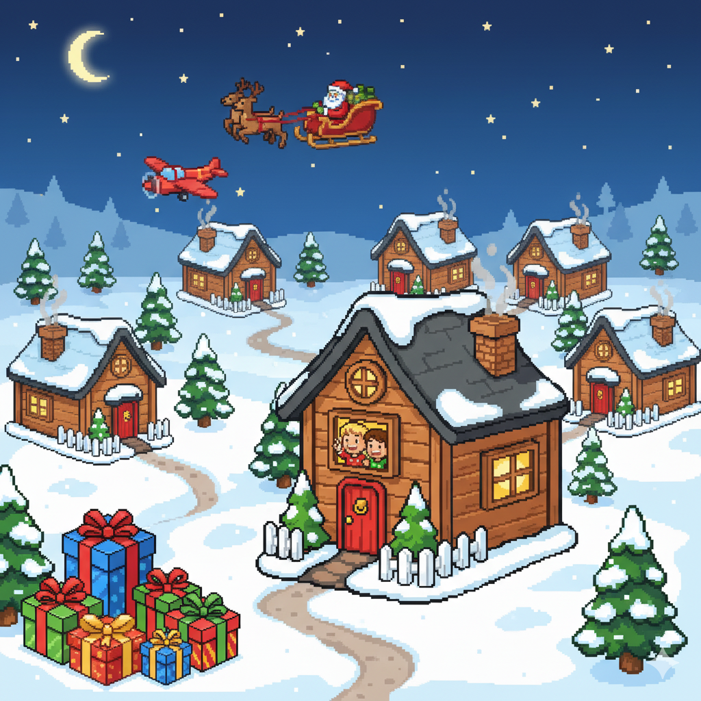
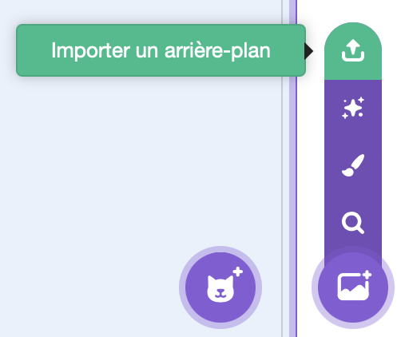
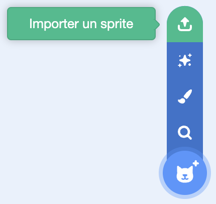
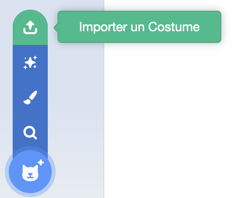

## Introduction

Cette année nous allons aider le Père-Noël à faire sa distribution de cadeaux. Tout en évitant les avions, le Père Noël va devoir distribuer des cadeaux aux enfants dans les maisons, mais gare au Grinch.

## Préparons la scène du jeu
Nous allons utiliser le logiciel Scratch pour faire notre jeu. Rends-toi à l'adresse https://scratch.mit.edu et clique sur le bouton _Créer_ en haut à gauche.
Le logiciel se charge. Tu peux fermer toutes les fenêtres vertes de Tutoriel. En bas à droite tu as la zone des _sprites_ (éléments de jeu). Par défaut tu as un seul sprite chat. Tu peux le supprimer car nous n'en aurons pas besoin. Pour cela, clique sur la poubelle à côté de son icône dans la zone des sprites.  
Maintenant, nous allons mettre un fond à notre jeu. En bas à droite, passe ton curseur **sans cliquer** sur ce bouton:

Puis clique sur importer un arrière plan:

Choisis ensuite le fichier _fond.png_ depuis les resources du TP. Tu devrais voir s'afficher un joli paysage enneigé.

## Animons le Père-Noël 
Commençons par ajouter le sprite du Père-Noël. Assure-toi de bien être dans l'onglet _Code_ en haut à gauche puis survole ce bouton dans la zone des sprites **sans cliquer dessus**:

Puis clique sur le bouton _Importer un sprite_

Choisis ensuite le fichier _pereNoel.png_. Le Père-Noël est maintenant visible dans notre jeu mais il est un peu grand. Dans la zone des sprites, tu vois que sa taille est de 100. Change cette valeur pour mettre 30.
Maintenant nous allons faire en sorte que le Père-Noël monte et descend quand tu appuies sur les touches haut et bas de ton clavier.
Pour cela tu vas avoir besoin des blocks suivants:
<pre class="blocks">
quand le drapeau vert pressé
</pre>
<pre class="blocks">
aller à x: (-150) y:(0)
</pre>
<pre class="blocks">
répéter indéfiniment
</pre>
<pre class="blocks">
si <> alors
</pre>
<pre class="blocks">
touche [ v] pressée
</pre>
<pre class="blocks">
ajouter (10) à y
</pre>

Tu as trouvé ? Vérifie la correction ci-dessous:

<pre class="blocks">
quand le drapeau vert pressé
  aller à x: (-150) y:(0)
  répéter indéfiniment
      si <touche [flèche haut v] pressée ?> alors
          ajouter (10) à y
      si <touche [flèche bas v] pressée ?> alors
          ajouter (-10) à y
</pre>

Maintenant, quand tu cliques sur le bouton vert, le Père-Noël montera si tu appuyes la flèche du haut et descendra si tu appuyes sur la flèche du bas.

## Évitons les avions
Maintenant que Père-Noël sait monter et descendre. On va faire déplacer un avion de droite à gauche et Père-Noël devra l'éviter. 
Nous allons commencer par ajouter le sprite d'avion en suivant la même méthode que nous avons ajouté le sprite de Père-Noël.
Survole ce bouton dans la zone des sprites **sans cliquer dessus**:

Puis clique sur le bouton _Importer un sprite_

Choisis ensuite le fichier _avion.png_. L'avion est maintenant visible dans notre jeu. Comme pour Père-Noël, nous allons devoir réduire sa taille. Dans la zone des sprites, tu vois que sa taille est de 100. Change cette valeur pour mettre 50.
 
Tu vas maintenant devoir animer ton avion avec les conditions suivantes:
* quand on clique sur le drapeau vert, l'avion va se positionner tout à droite de l'écran à une hauteur aléatoire dans la partie haute de l'écran
* l'avion va devoir se déplacer horizontalement jusqu'à disparaitre à gauche de l'écran
* ce déplacement va durer 2 secondes
* ensuite il va falloir attendre un temps entre 1 et 3 secondes avant de faire réapparaitre l'avion et le faire déplacer selon les mêmes conditions

Essaye de trouver toi-même comment faire cela. Si tu ne trouves pas, tu peux regarder la suite qui te donnera les blocs à utiliser.
 
 
 
 
 
 
 
 
 
 
 
 
Voici la liste des blocs dont tu auras besoin pour animer ton avion.

<pre class="blocks">
quand le drapeau vert pressé
</pre>
<pre class="blocks">
nombre aléatoire entre () et ()
</pre>
<pre class="blocks">
attendre () secondes
</pre>
<pre class="blocks">
glisser en () secondes à x:() y:()
</pre>
<pre class="blocks">
répéter indéfiniment
</pre>
<pre class="blocks">
aller à x:() y:()
</pre>
<pre class="blocks">
ordonnée y
</pre>

Si tu n'as toujours pas trouver, tu peux aller voir la suite pour avoir la correction.

 
 
 
 
 
 
 
 
 
 
 
 

Voici une solution pour animer ton avion tel que demandé:

<pre class="blocks">
quand le drapeau vert pressé
  répéter indéfiniment
    aller à x:(300) y:(nombre aléatoire entre (0) et (150))
    glisser en (2) secondes à x:(-300) y:(ordonnée y)
    attendre (nombre aléatoire entre (1) et (3)) secondes
</pre>

## Arrêtons tout quand Père-Noël touche l'avion
Évitez l'avion ne sert pas vraiment à grand chose vu que Père-Noël passe à traver de l'avion. Peux-tu faire en sorte que le jeu s'arrête quand le Père-Noël touche l'avion.
Essaye de trouver sinon continue plus loin pour avoir la liste des blocs à utiliser.
 
 
 
 
 
 
 
 
 
 
 
 
Voici la liste des blocs dont tu auras besoin pour arrêter le jeu quand Père-Noël touche l'avion.

<pre class="blocks">
quand le drapeau vert pressé
</pre>
<pre class="blocks">
stop [tout v]
</pre>
<pre class="blocks">
répéter indéfiniment
</pre>
<pre class="blocks">
si <> alors
</pre>
<pre class="blocks">
<touche le ( v)>
</pre>

Si tu n'as toujours pas trouver, tu peux aller voir la suite pour avoir la correction.

 
 
 
 
 
 
 
 
 
 
 
 
Voici une solution pour pouvoir arrêter le jeu quand Père-Noël touche l'avion. Depuis le sprite avion, ajoute les blocs suivants:

<pre class="blocks">
quand le drapeau vert pressé
  répéter indéfiniment
    si <touche le (pereNoel v)> alors
      stop [tout v]
</pre>

## Animons la maison
Dans les airs les avions passent. Mais au sol ? Nous allons mettre des maisons. Ajoute le sprite de maison de la même manière que tu as ajouté les sprites du Père-Noël et de l'avion à partir du fichier _maison.png_.
Survole ce bouton dans la zone des sprites **sans cliquer dessus**:

Puis clique sur le bouton _Importer un sprite_

Choisis ensuite le fichier _maison.png_.
Change ensuite la taille de la maison pour qu'elle soit de 50.
En t'inspirant de ce qui a été fait pour l'avion, essaye de faire déplacer la maison de la manière suivante:
* La maison commence son mouvement en bas à droite de l'écran
* la maison se déplace horizontalement vers la gauche
* elle arrive en 4 secondes à gauche de l'écran
* au bout d'une seconde, elle réapparait à droite de l'écran et recommence son mouvement
* si l'avion touche la maison, le jeu s'arrête

Les blocs vont être similaire à ceux utilisés par l'avion. __Attention à bien sélectionner le sprite de la maison quand tu ajoutes tes blocs__.

 
 
 
 
 
 
 
 
 
 
 
 

Voici une solution pour animer ta maison tel que demandé:

<pre class="blocks">
quand le drapeau vert pressé
  répéter indéfiniment
    aller à x:(300) y:(-110)
    glisser en (4) secondes à x:(-310) y:(-110)
    attendre (1) secondes
</pre>

Et voici le bloc à ajouter pour faire arrêter le jeu quand l'avion touche la maison

<pre class="blocks">
quand le drapeau vert pressé
  répéter indéfiniment
    si <touche le (pereNoel v)> alors
      stop [tout v]
</pre>

## Changeons le type de maison
Au soir de Noël, on peut trouver plusieurs types de maison. Des maisons vides, car les enfants sont allés passer Noël en famille. On en déduit qu'il y aussi des maisons avec des enfants. Malheureusement, le Grinch est aussi de la partie. Dans certaines maison nous trouverons aussi le Grinch. Nous allons revoir notre sprite de maison pour qu'il affiche aléatoirement des maisons vides, des maisons avec des enfants ou des maisons avec le Grinch. Commençons par modifier notre sprite maison pour qu'il puisse gérer ces différents types de maison. Après avoir sélectionné le sprite _maison_, clique sur l'onglet _Costumes_ en haut à gauche. Pour le moment, ton sprite ne contient qu'un seul costume _maison_. Survole **sans cliquer** l'image qui se trouve en bas à gauche:

Puis clique sur le bouton _Importer un costume_

Choisi le fichier _enfants.png_ puis réimporte un autre costume de la même manière pour ajouter le fichier _grinch.png_.
Ton sprite à maintenant 3 costumes:
* maison
* enfants
* grinch

Nous allons maintenant créer une variable. Sélectionne l'onglet _Code_ du sprite _maison_. Dans la section _Variables_ à gauche, clique sur _Créer un variable_ et crée une variable que tu peux nommer _costumeMaison_. **Assure-toi que cette variable soit disponible pour tous les sprites** (tu en auras besoin plus tard).
Maintenant, à l'aide de cette variable, tu vas reprendre le bloc de code qui gère le mouvement de la maison pour ajouter la fonctionalité suivante
**avant d'afficher la maison à droite, elle doit basculer sur un costume aléatoire parmis les 3 disponibles**.

Essaye de trouver par toi-même, les blocs à utiliser te sont présentés plus loin.
 
 
 
 
 
 
 
 
 
 
 
 
Voici la liste des blocs dont tu auras besoin pour changer le type de la maison.

<pre class="blocks">
nombre aléatoire entre () et ()
</pre>
<pre class="blocks">
(costumeMaison)
</pre>
<pre class="blocks">
mettre [ v] à ()
</pre>
<pre class="blocks">
si <> alors
</pre>
<pre class="blocks">
basculer sur le costume [ v]
</pre>
<pre class="blocks">
<()=()>
</pre>
Encore un indice, tu peux utiliser la valeur de la variable _costumeMaison_ pour savoir quel costume sélectionner.

Si tu ne trouves pas, une proposition de solution t'es donnée plus loin. 
 
 
 
 
 
 
 
 
 
 
 
Voici une proposition de solution:
<pre class="blocks">
quand le drapeau vert pressé
  répéter indéfiniment
    mettre [costumeMaison v] à (nombre aléatoire entre (1) et (3))
    aller à x:(300) y:(-110)
    si <(costumeMaison)=(1)> alors
      basculer sur le costume [maison v]
    fin
    si <(costumeMaison)=(2)> alors
      basculer sur le costume [enfants v]
    fin
    si <(costumeMaison)=(3)> alors
      basculer sur le costume [grinch v]
    fin
    glisser en (4) secondes à x:(-310) y:(-110)
    attendre (1) secondes
</pre>

## Distribuons les cadeaux