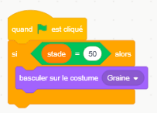
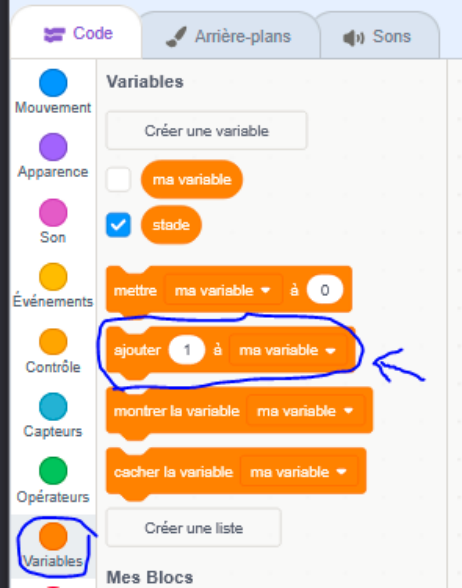
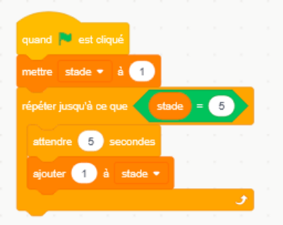

# Plantagotchi

## Introduction

Nous allons créer un jeu de plantes de compagnie, dans le même style que les petits Tamagotchi, mais
avec une plante !

Le principe de ce jeu c’est d’avoir une créature qui grandit.
Il faut donc avoir un “sprite” avec plusieurs “costumes”, un costume par étape de croissance de notre
plante.

## 1) Créer vos sprites:

Dans la section des sprites, cliquez sur ajouter un sprite (le chat avec un signe +), puis sur “Peindre”

### 1.1) La plante

J’ai ajouté un nouveau Sprite que j’ai appelé “Plante”.
Sur le canvas, vous pouvez dessiner une plante simple pour le premier costume, puis le dupliquer pour
ajouter des feuilles. J’ai fait 5 costumes pour 5 stades de croissance, dont un correspond au stade graine,

### 1.2) Importer des images en tant que costumes

Si vous n’aimez pas dessiner, une alternative c’est d’importer les images que vous souhaitez utiliser dans
l’onglet costume, après avoir créé un nouveau sprite.

Vous pouvez trouver nos images dans le lien:
[https://github.com/Kidikod/scratch_tp/tree/main/plantagotchi_tp/plant_images](https://github.com/Kidikod/scratch_tp/tree/main/plantagotchi_tp/plant_images)

## 2) Animer la croissance de la plante

Maintenant que nous avons les graphiques nécessaires, passons à la programmation !
Code = Comportement !

### 2.1) Ajouter une variable

Rappelons nous que le principe de ce jeu c’est d’avoir une créature qui grandit.
Il faut commencer par créer une variable pour connaître et modifier le stade de croissance de notre
“Plantagotchi”.

Nous allons cliquer sur l'arrière plan, puis dans la categorie “variable” -> créer une nouvelle variable.
Nous allons l'appeler “stade”

Notre nouvelle variable apparaît en haut de l'écran du jeu. Avec click droit, nous allons changer
l’affichage en barre de défilement pour pouvoir mieux la contrôler.

On voit apparaître à l'écran la barre de défilement:

### 2.2) Ajouter le code

Pour faire cela, on clique dans le sprite de la plante, puis dans l’onglet “Code” pour ajouter le code qui la

contrôle.

Le code commence toujours par l'événement qui le déclenche. Dans notre cas, nous voulons que la
plante change d'état à partir du moment où notre jeu démarre.
Dans la catégorie “événements”, nous ajoutons l'événement “quand le drapeau vert est cliqué”.

### 2.3) Changer l’apparence

Ensuite, nous voulons changer l’apparence de la plante. Dans la catégorie “Apparence”, on prend la
brique “basculer sur le costume Graine”.

On clique sur le drapeau vert pour l'exécuter !

Comportement observé: peu importe le stade de la plante dans la fenêtre du jeu, quand on clique sur le
drapeau vert, la plante devient une graine. Mais rien d’autre ne se passe. Même si on bouge la valeur de

la barre de stade.

Ce dont nous avons besoin c’est que l'ordre de “basculer sur le costume Graine” soit conditionnée par la

valeur de la variable stade.

### 2.4) Contrôle conditionnel

On va utiliser le bloc de “Contrôle” “Si quelque-chose, alors on bascule sur le costume…”. Le
“quelque-chose” s’appelle “condition” et nous allons le rajouter après.

Voici à quoi cela ressemble:

Il ne reste plus qu’à remplir la valeur de la “condition”. Pour cela il faut réfléchir dans quel cas nous

voulons basculer sur le costume Graine?

Alors, la condition serait que la variable “stade” soit 1. Pour comparer la variable stade, nous utiliserons
un “operateur”

### 2.5) Operateur “egal à”

Dans la catégorie opérateur, on veut comparer si la valeur est exactement égale à 1.

On revient dans la catégorie “variable” et on glisse “stade” das l’emplacement blanc

Notre code ressemble à ça maintenant:

Cet opérateur va comparer la variable stade avec le chiffre 50, et si stade est 50, alors il va exécuter le
code à l'intérieur (“basculer sur le costume Graine”).
**Quelle valeur faut-il mettre à la place de 50?**

Réponse:
Ce que nous voulons obtenir comme comportement, c’est une animation qui montre le costume de la
graine quand nous sommes au stade 1, puis la petite plante au stade 2, ainsi de suite jusqu’à la plante
adulte au stade 4, puis la plante sèche au stade 5.

|Col1|Col2|Col3|Col4|Col5|
|---|---|---|---|---|
|graine|petite|moyenne|grande|sèche|
|Stade = 1|Stade = 2|Stade = 3|Stade = 4|Stade = 5|

Donc nous avons besoin de comparer stade a la valeur 1 pour le costume “Graine”

**Maintenant, c’est a toi de jouer :**

Enchaîne à la suite autant de blocs “si …, alors …” que nécessaire pour chaque valeur de la variable

stade.

N’oublie pas d' ajuster le bon costume pour la bonne valeur !
Si tu as des doutes, tu peux vérifier le comportement en exécutant le code (en cliquant sur le drapeau
vert).

Voici à quoi doit ressembler ton code a la fin :

Super ! On peut cliquer sur le drapeau vert de l'écran pour exécuter notre code et voir si la plante évolue
quand on bouge la valeur de la variable stade.

Oh non! Ça marche seulement une fois, selon l'état de la variable quand on clique sur le drapeau !

Que pouvons-nous ajouter pour vérifier en continu l'état de la variable et réagir tout le temps? (et pas
seulement une fois au début ?)

Piste: dans la catégorie “Contrôle”

### 2.6) Répéter indéfiniment

Répète indéfiniment c'est une bloc de contrôle qui permet de répéter le code à l'intérieur encore et
encore, jusqu’à que le programme s’arrête.

Solution:

Et maintenant on peut vérifier le fonctionnement à nouveau en appuyant sur le drapeau vert.
Chouette ! Quand la variable stade est 1, on voit bien la graine, puis la plante évolue pour les autres

valeurs de stade.

## 3) Ajouter le passage du temps

Maintenant que la plante change de costume selon la valeur de la variable “stade”, nous aimerions faire
évoluer le stade de croissance avec le passage du temps.

### 3.1) Savoir attendre =)

Nous pouvons imaginer que la plante grandit un stade chaque minute.
Le bloc qui permet d’attendre se trouve dans la catégorie “Contrôle”.

Ajoutons ce bloc et on change la valeur à 60 secondes (une minute).
N’oubliez pas d’ajouter “quand le drapeau vert est cliqué”, pour que le temps commence à couler quand
le programme commence.

Vous pouvez ajuster le temps à votre convenance, mais si vous avez choisi 60 secondes, votre code
ressemble à ça :

### 3.2) Grandir la plante

Le comportement que nous voulons obtenir c’est : une fois passés 60 secondes, le stade évolue. Pour
cela nous allons dans la catégorie variable et le bloc “ajouter 1 a ma variable” semble pertinent pour ça:

Notre code ressemble à ça:

Alors, chaque fois qu’on ajoute un comportement, on peut vérifier si ca fait ce qu’on veut.
Petit coup de drapeau vert et…
C’est trop long pour faire des tests à répétition… on va réduire le temps à 5 secondes juste pendant le
développement de notre programme !

Petit coup de drapeau vert et…
Top ! la plante grandit d’un cran !!

Mais seulement d’un cran… que devons nous ajouter pour que cela se passe tout le temps?
Piste: nous l’avons déjà fait dans 2.6 =)

Réponse: le code ressemble a ca:

Petit coup de drapeau vert :
On constate 2 problemes :

  - ​ La plante commence dans le stade ou elle était

  - ​ La variable stade grandit indéfiniment, tant qu’on n’arrête pas l'exécution et dépasse notre valeur

maximale.

### 3.3) Initialiser la variable

On a besoin de remettre le stade à sa valeur initiale au début.

Pour cela nous allons utiliser le bloc “mettre ma variable à 0” dans la catégorie “variables”

**Mais, où l’ajouter? Et aussi, est-ce que la valeur 0 nous convient?**

Si tu as mis la bonne variable, la bonne valeur et le tout au bon endroit, ton code devrait ressembler à ça:

Est-ce que ça marche? -> Drapeau Vert -> yes !!
Mais il nous reste à corriger le problème de l'incrément de stade à l’infini

### 3.4) Savoir quand s’arrêter !

Comportement que nous voulons corriger:

Il y a souvent plusieurs façons de faire les choses.
Voici deux possibilités:

  - ​ Si on dépasse 5, on remet 5 dans la variable

  - ​ On arrête de répéter indéfiniment l’ajout quand le stade est 5

Pour la première idée, tu connais déjà tous les blocs nécessaires.
Pour la deuxième possibilité, nous allons remplacer le bloc “répéter indéfiniment” par “répéter jusqu’à ce
que”

Ce bloc répète le code a l'intérieur encore et encore tant que la condition est fausse. Puis, dès que la
condition devient vraie, la répétition s'arrête.

Le code:

Quand il y a un trou en losange c’est parce qu’il manque une condition…

Nous avons fait cela dans 2.4.

Quelle est la condition que nous devons ajouter ici?

Réponse : nous voulons répéter jusqu’à ce que stade = 5.

Le code :

Le drapeau vert pour vérifier si le comportement obtenu correspond au comportement que nous voulons
-> comportement observé:

-​ on commence par la graine,
-​ avec le passage de temps, la plante grandit,
-​ puis elle meurt et la variable stade reste à la bonne valeur(5).

### 3.5) Cacher l’affichage de la variable stade

Une fois que notre plante grandit correctement et que nous avons corrigé tous les problemes de la
variable “stade”, et vérifier qu'elle marche correctement, nous pouvons cacher l’affichage de la variable.
Cela fait un écran “propre” pour l’utilisateur.

## 4) Ajouter des besoins

Dans les Tamagotchis, la créature grandit avec le temps. Mais il faut s’occuper d’elle, satisfaire ses
besoins, pour qu’elle puisse arriver au stade adulte.

### 4.1) Arroser la plante

Nous pouvons ajouter un besoin évident pour une plante : de l’eau.

Traçons d’abord le chemin logique à parcourir pour ajouter ce besoin.
Avons-nous besoin de sprites?

Des variables?

Quelles comportements voulons nous obtenir?
Quel est le défi ajouté pour l’utilisateur du jeu?

**Nous pouvons ajouter un spirit “goute”**
**Nous pouvons ajouter une variable “eau”**
**Nous pouvons ajouter une visualisation du niveau d’eau dans l’écran de jeu**

Comportement proposé :

  - ​ Quand on clique sur le sprite goute, on augmente le niveau d’eau (on arrose la plante).

  - ​ La plante consomme une goute d’eau tous les 10 secondes.

  - ​ Si la plante est à 0 eau, elle meurt (stade 5, game over).

  - ​ Si la plante est à 5 eau, elle meurt aussi (stade 5, game over)

Défi : Le joueur doit maintenir le niveau d’eau de 1 à 4 pour que la plante grandisse correctement

Tu as déjà découvert et utilisé tous les blocs dont tu as besoin. Tu peux continuer à lire cette section si tu
préfères suivre un guide, ou tu peux essayer de le faire en autonomie.

**Nous restons à disposition pour toute question ou pour donner un petit coup de main.**

### 4.1.1) Ajouter un sprite “Goutte”

Ça peut être une goutte, un arrosoir, ce que tu veux !

Example :

Voici où trouver notre image de goutte:
[https://github.com/Kidikod/scratch_tp/tree/main/plantagotchi_tp/other_images](https://github.com/Kidikod/scratch_tp/tree/main/plantagotchi_tp/other_images)

### 4.2.1) Ajouter le comportement

Exemple de solution (Il y a plusieurs façons de programmer le même comportement).
Comportement lors de l’action d’arrosage:

Comportement de l’eau dans le temps:
Au début, on met la valeur de eau à 2 (on l'initialise).
La plante “boit” avec le temps (j’ai mis qu’elle boit tous les 4 secondes)

Interaction entre la variable “eau” et la variable “stade”:

La plante meurt s'il n’y a plus d’eau ou si elle est trop arrosée (si l’eau arrive à 5)

### 4.2.3) Animer l’arrosage

Aussi, on pourrait placer la goutte au dessus de la plante et ajouter une petite animation qui fait que la
goutte tombe sur la plante:

|Ecran de jeu :|Code pour animer le déplacement de la goutte quand on clique dessus :|
|---|---|
|||

### 4.2) Indicateur du niveau d’eau

La barre de défilement est confortable pour le développement de notre jeu, mais ce serait mieux de la
cacher et de montrer seulement le niveau d’eau de la plante avec un indicateur.

Pour cela, nous avons besoin de créer un sprite “Niveau”.

Comment aimerais tu indiquer le niveau d’eau de la plante?
Par un chiffre? Par une couleur? Par une barre? Par un nombre de gouttes?

Tu peux décider ton propre chemin et **nous restons à disposition pour toute question ou pour**
**donner un petit coup de main.**

Peu importe le type d’indicateur choisi, il faut créer 6 costumes pour notre sprite “Niveau”, avec ce qu’on
veut montrer dans chaque valeur de la variable “eau”.

Pour rappel, “eau” peut avoir des valeurs du 0 à 5 (6 valeurs).

|Chiffres|Gouttes|
|---|---|
|Si on choisit de le représenter par des chiffres, il suffit d’ajouter un champs de texte au centre du sprite, puis le dupliquer 5 fois en changeant la valeur de l’indicateur|Si on choisit de le représenter par un nombre de gouttes pleines ou vides, voila a quoi peut ressembler notre sprite: |
|||

### 4.2.4) Le code de l’indicateur

Nous avons déjà couvert comment changer le costume selon la valeur d’une variable (nous avons déjà
changé le costume de la plante selon la valeur de “stade”). Ici, il s’agit de changer le costume de “Niveau”

selon la valeur de la variable “eau”.

**A toi de jouer !**

**=D**

Voici à quoi peut ressembler notre code dans le Sprite “Niveau”:

### 4.2.5) Cacher l’affichage de la variable eau

Une fois que notre goutte marche correctement pour ajouter de l’eau a notre plante et que nous avons
mis en place notre indicateur de niveau, et vérifié qu’il marche correctement, nous pouvons cacher
l’affichage de la variable “eau”.

### 4.3) Des besoins similaires

D’autres besoins que la plante peut avoir, comme de l’engrais ou de la lumière peuvent être ajoutés.

A toi de proposer un plan d’action et d’essayer !
**Nous restons à disposition pour toute question ou pour donner un petit coup de main.**

Tous ces exemples, comme l’eau, représentent des besoins permanents qui se consomment avec le
temps. Dans la comparaison avec un Tamagotchi, ces besoins sont équivalents à la nourriture ou le
jeu/bonheur.

**Cette section n’est pas obligatoire si tu ne souhaites pas ajouter des besoins pour ton**
**plantagotchi.**

## 5) Fin de jeu

Ce n’est peut être pas évident pour l’utilisateur que le jeu est fini et que la plante est morte quand elle
arrive au stade 5. Nous allons ajouter un panneau “Game Over” puis un autre “semer une nouvelle
graine” pour pouvoir recommencer.

### 5.1) Sprite “Game Over”

Créons un nouveau Sprite appellé “Game Over”

Dans l’onglet “costume” nous allons utiliser l’outil “texte” pour écrire “GAME OVER”. J’ai utilisé la couleur
rouge et le font Pixel, mais tu peux utiliser celui que tu préfères !

Dans l'écran de jeu, on déplace le texte à l'endroit où on voudrait qu’il s’affiche.

Puis, on clique sur le drapeau vert…
Oh non, le jeu commence, mais le panneau de GAME OVER est toujours visible.
Le comportement souhaité c’est qu’il disparaisse quand on commence le jeu et qu’il apparait quand la
plante arrive au stade 5.
Ce qu’on peut faire, c’est de le cacher quand le stade est 5 ou moins, et le montrer autrement. Donc nous
avons besoin d’un bloc de control de condition (que nous connaissons déjà) et qui surveille la valeur de la
variable stade pour cacher ou montrer le panneau “GAME OVER”.

Voici les blocs à utiliser pour montrer ou cacher un sprite:

Où pouvons-nous ajouter le code?
Comment pouvons nous obtenir ce comportement?

En cliquant sur le drapeau vert, on vérifie que le comportement obtenu correspond bien à celui recherché

## 6) Notifications

Dans notre jeu, la plante meurt assez facilement sans que l’utilisateur en soit conscient. Nous pourrions
prévenir l’utilisateur que la plante a un besoin avant qu’elle ne meure.

### 6.1) Plan d’action proposé pour les notifications

Comme avant, on trace d’abord le plan pour ajouter des notifications.

Avons-nous besoin de variables?

Quelles comportements voulons nous obtenir?
Quel est le bénéfice ajouté pour l’utilisateur du jeu?
Est-ce qu’on lui laisse la possibilité de désactiver le son?

### 6.2) Émettre une alerte

Pour jouer un son d’alerte, il y a 2 blocs qui peuvent nous intéresser:

Le premier sert à jouer un son et attendre jusqu’à que le son soit fini.
Le deuxième sert à jouer un son SANS attendre qu’il soit fini.
Tu peux les essayer afin de comprendre la différence entre les deux.

Par exemple, on peut choisir de jouer 3 fois de

suite le son “alert”. Afin d’entendre 3

retentissement à la suite, je dois choisir de les
jouer jusqu’au bout.

Ou sinon, 2 fois le “Clown Honk” :

A toi d’essayer et choisir la combinaison qui te convient.

### 6.3) Alerter en cas de sécheresse

Nous pouvons utiliser le niveau d’eau (variable que nous avons déjà) pour émettre un son quand le
niveau d’eau est critique, par exemple, quand le niveau est de 1. Comme ça, l’utilisateur aura 10
secondes pour réagir avant que la plante ne meurt.

**Que devons-nous ajouter pour faire cela? (piste: on cherche à évaluer une condition lors que l’on**
**décrémente l’eau!)**

On peut modifier le code du Sprite “Goutte” pour ajouter l’alarme quand le niveau d’eau baisse jusqu’à

“1”:

|Avant|Après|
|---|---|
|||

### 6.4) Envoi des Messages

Une autre possibilité c’est d’utiliser le système d’envoi des messages.
Si nous avons une condition qui peut affecter plusieurs Sprites au même temps, nous pouvons leur
envoyer un message pour leur informer de l'occurrence d’un événement.

Les bloc qui permet d’envoyer les messages est indiqué en 1 et le bloc qui permet de les recevoir en 2 :

On peut créer de nouveaux messages quand on en a besoin.

**Attention, si on ajoute des messages dans tous les sens, notre code devient très compliqué et si**
**nous avons un comportement inattendu, c’est plus difficile à comprendre d’où il vient !**

|Avant|Après|
|---|---|
|| +  |

### 6.4) Alerter en cas d'excès d’arrosage

Nous pouvons utiliser le niveau d’eau (variable que nous avons déjà) pour émettre un son quand le
niveau d’eau est trop élevé (4). Comme ça, l’utilisateur sait que s’il continue a l’arroser, la plante mourra.

Que devons-nous ajouter pour faire cela? (piste: on cherche à évaluer une condition lorsqu’on incrémente
l’eau !)

**Tu as déjà découvert et utilisé tous les blocs dont tu as besoin pour faire cela.**
**Nous restons à disposition pour toute question ou pour donner un petit coup de main.**

**Cette section n’est pas obligatoire si tu ne souhaites pas ajouter une alerte additionnelle.**

## 7) Ajouter de la vie

Tous les jeux aujourd’hui bougent en permanence. Quand un visuel est statique, nous avons tendance à
penser que le jeu est figé. Il y a donc un intérêt à ajouter du mouvement a notre plante pour donner un
effet “vivant” agréable à l’utilisateur.

### 6.1) Ajouter du mouvement

Nous pouvons utiliser la réflexion horizontale de nos sprites plante pour créer deux costumes par stade et
les basculer par intermittence toutes les secondes pour donner du mouvement a notre plante.

### 6.2) La fleur, des émotions

Nous pouvons ajouter un sprite fleur, qui se montre seulement au stade adulte (dernier stade avant
mourir, et qui donne quelque chose en plus pour motiver l'utilisateur a arriver a ce stade.

**Cette section n’est pas obligatoire si tu ne souhaites pas ajouter une fleur pour ton plantagotchi.**

6.2.1) Donner plus de temps au dernier stade

Actuellement, chaque stade dure 5 secondes. C’est bien pour faire des tests du comportement de notre
jeu, mais ce n’est pas suffisant pour ajouter des émotions au dernier stade. Nous devons donc
commencer par rendre le dernier stade plus long.

**Comment pouvons nous faire cela?**
**Quel code devons-nous modifier? Et comment?**

Voici une proposition de modification à notre code initial pour garder 5 secondes pour les stades 1
(graine) à 3 (moyenne), puis prolonger à 30 secondes le stade 4 (grande) avant de passer au stade 5
(game over)

D'ailleurs, tu pourrais varier le temps de chaque stade à ta convenance ! Par exemple, les Tamagotchis
traditionnelles passent quelques minutes au stade œuf (ou graine), puis chaque stade dure de plus en
plus de temps, jusqu’à la mort.

6.2.2) Sprite Fleur

Ensuite, nous avons besoin d’un nouveau Sprite “Fleur”
Sur le canvas, vous pouvez dessiner une fleur. J’ai décidé de lui ajouter un visage pour que la plante soit
plus attachante

Autrement, vous pouvez importer l’image de la fleur tel que décrit en 1.2 après avoir créé un nouveau
sprite.

Vous pouvez trouver nos images de fleur dans le lien:
[https://github.com/Kidikod/scratch_tp/tree/main/plantagotchi_tp/flower_images](https://github.com/Kidikod/scratch_tp/tree/main/plantagotchi_tp/flower_images)

6.2.3) Animer l’apparition de la fleur

Le comportement souhaité :

  - ​ La fleur se montre dans le stade 4, en haut de la tige.

  - ​ La fleur doit être cachée pour les autres stades.

Tu as déjà découvert et utilisé tous les blocs dont tu as besoin pour faire cela (dans le sprite Game Over).
Tu peux essayer d’obtenir le comportement décrit (ou un autre comportement imaginé par toi)

**Nous restons à disposition pour toute question ou pour donner un petit coup de main.**

6.2.4) Ajouter les émotions de la fleur

Dans le sprite, nous pouvons ajouter un costume par émotion, puis nous pouvons afficher

-​ La joie quand la plate reçoit de l’eau
-​ La peur quand le niveau d’eau est de 1
-​ La tristesse ou la colère quand le niveau d’eau est de 4
-​ Tout ce dont tu pourrais imaginer et avoir envie…

**Tu as déjà découvert et utilisé tous les blocs dont tu as besoin pour faire cela.**
**Nous restons à disposition pour toute question ou pour donner un petit coup de main.**

**Cette section n’est pas obligatoire si tu ne souhaites pas ajouter des émotions pour ton**
**plantagotchi.**

## 7) Merci

Kidikod vous remercie d’avoir partagé avec nous ce coding goûter, votre temps, vos créations, et le
goûter, miam !

Voici l’hyperlien si vous souhaitez jouer avec notre création (conçue pendant l’écriture de cette guide) :
[https://scratch.mit.edu/projects/1154751260](https://scratch.mit.edu/projects/1154751260)

