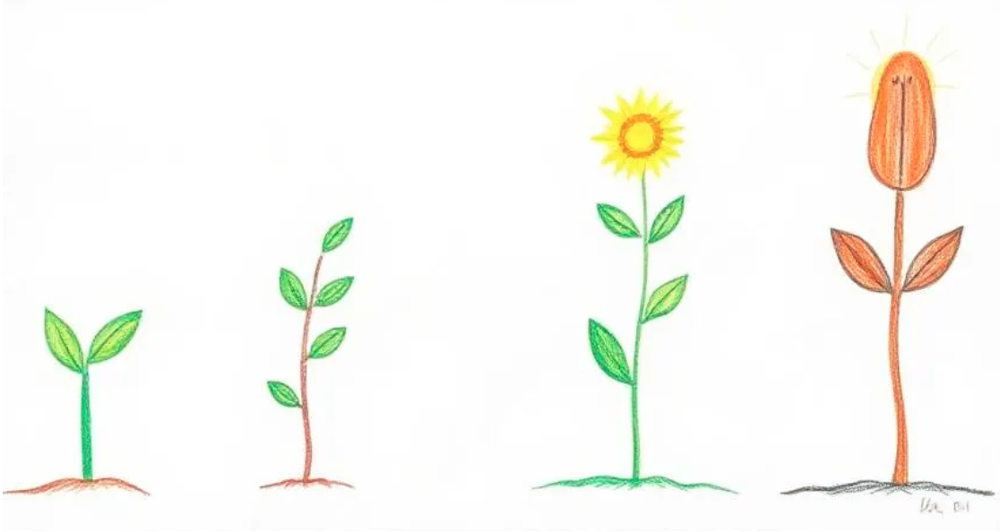
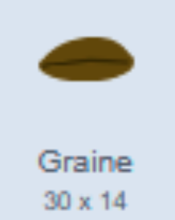
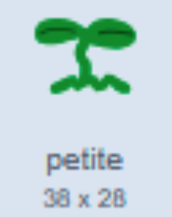
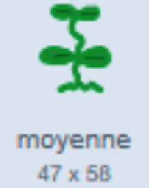
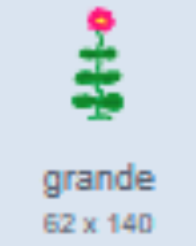
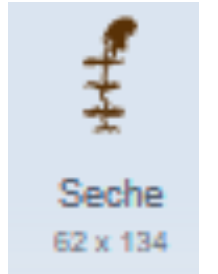

# Plantagotchi

Test

## Introduction

Nous allons créer un jeu de plantes de compagnie, dans le même style que les petits Tamagotchi, mais
avec une plante !

Le principe de ce jeu c’est d’avoir une créature qui grandit.

Il faut donc avoir un “sprite” avec plusieurs “costumes”, un costume par étape de croissance de notre
plante.

### Créer vos sprites

Dans la section des sprites, cliquez sur ajouter un sprite (le chat avec un signe +), puis sur “Peindre”

#### La plante

J’ai ajouté un nouveau Sprite que j’ai appelé “Plante”.

Sur le canvas, vous pouvez dessiner une plante simple pour le premier costume, puis le dupliquer pour
ajouter des feuilles. J’ai fait 5 costumes pour 5 stades de croissance, dont un correspond au stade graine, et le dernier stade c’est la plante sèche.

